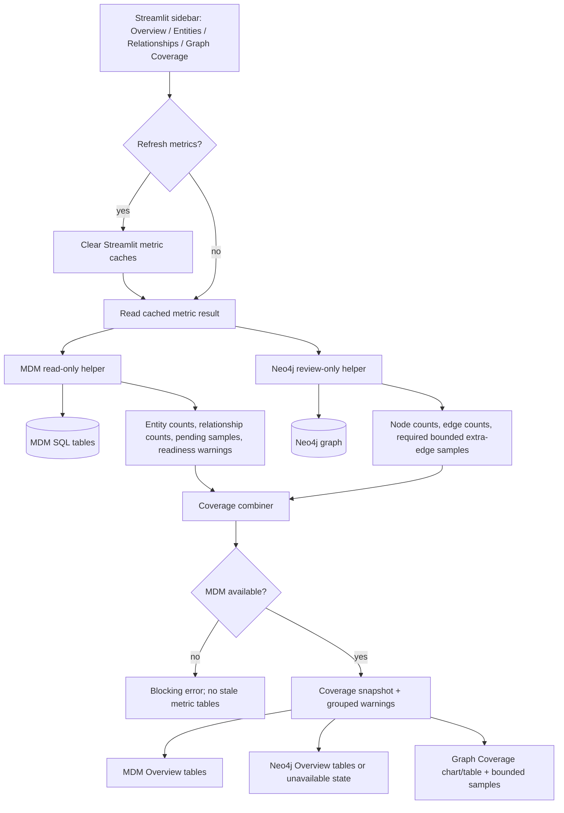

# Phase 09: MDM And Neo4j Review Metrics - Research

**Researched:** 2026-05-20
**Domain:** Read-only MDM SQLAlchemy metrics, Neo4j review metrics, Streamlit operator dashboard
**Confidence:** HIGH for codebase integration, bounded diagnostic semantics, and tests. [VERIFIED: codebase grep; CITED: Neo4j Python Driver Manual; RESOLVED]

<user_constraints>
## User Constraints (from CONTEXT.md)

Copied from `.planning/workstreams/mdm-neo4j-dashboard/phases/09-mdm-and-neo4j-review-metrics/09-CONTEXT.md`. [VERIFIED: 09-CONTEXT.md]

### Locked Decisions

#### Metric Priority And Layout
- **D-01:** The first real metrics view should lead with a coverage snapshot showing MDM entity counts, MDM relationship counts, Neo4j node/edge counts, and pending sync totals.
- **D-02:** Snapshot metrics should show count plus simple status, such as `OK`, `Pending sync`, `Missing graph data`, or `Unavailable`.
- **D-03:** Attention-needed signals in Phase 9 are sync and coverage gaps: pending sync rows, missing Neo4j counts, missing edges, extra graph data, or unavailable sources. Zero counts alone should not automatically be a warning.
- **D-04:** Organize detailed metrics into MDM Overview, Neo4j Overview, and Graph Coverage. Planners may refine exact labels, but must preserve this structure and meaning.
- **D-05:** Use a hybrid page layout: Overview gets the coverage snapshot; detailed metrics go into the relevant existing sidebar destinations.
- **D-06:** Show raw counts plus percentages where meaningful, especially graph coverage percent by relationship type when both MDM and Neo4j counts exist.
- **D-07:** If Neo4j is unavailable, MDM metrics remain usable. Neo4j and comparison metrics should be marked unavailable rather than blocking the entire metrics view.
- **D-08:** Lightweight charts are allowed where Streamlit makes them cheap, but charts must not delay or complicate the metric tables.
- **D-09:** Demote Phase 8 smoke output once real metrics exist. Keep it only as low-priority diagnostics or remove it from the primary view.

#### Refresh And Failure Display
- **D-10:** Prefer separate refresh per section for MDM, Neo4j, and Graph Coverage.
- **D-11:** The agent has discretion on whether to keep the existing global `Refresh data` button, add section refresh controls, or choose the cleanest Streamlit behavior after implementation research. Section-level refresh must not make the UI awkward.
- **D-12:** Show last-refreshed timestamps per section.
- **D-13:** Gather metric failures and attention signals into one warning area rather than repeating them inline in every section.
- **D-14:** The warning area should be grouped: blocking failures first, then non-blocking coverage warnings.

#### Missing-Edge And Coverage Diagnostics
- **D-15:** Missing-edge diagnostics should start with entity-domain coverage: compare company, adviser, person, security, and fund counts first, then relationship edge types.
- **D-16:** Entity-domain coverage should be chart-first, with side-by-side MDM vs Neo4j bars by domain and a details table underneath.
- **D-17:** Relationship edge coverage should use a per-type table with MDM active count, Neo4j edge count, pending sync count, missing estimate, and coverage percent.
- **D-18:** Missing estimate for relationship types is `MDM active count - Neo4j edge count`, clamped at zero when Neo4j has more edges.
- **D-19:** Show all registered active relationship types, including types with zero MDM active rows.
- **D-20:** When Neo4j has more edges than MDM active rows for a type, show an extra graph data warning.

#### Source-Readiness Warnings
- **D-21:** Show MDM readiness and graph sync readiness as separate warning groups.
- **D-22:** MDM readiness severity should distinguish structural problems from sparse data: missing registry data is warning/error; zero domain counts are informational unless the implementation finds a stronger reason.
- **D-23:** Graph sync readiness should warn for pending sync, Neo4j unavailable, lower Neo4j counts, and extra graph data.
- **D-24:** Warning severity should use three levels: error, warning, and info.
- **D-25:** Warnings should include short recommended operator action text, such as checking configuration or running existing MDM/graph sync commands, but must not add mutation buttons.

#### Bounded Sample Detail
- **D-26:** Phase 9 should include counts plus bounded sample rows for pending sync and missing/extra graph diagnostics.
- **D-27:** Sample rows should include operator-readable names when cheaply available, falling back to IDs when names are not cheap or reliable.
- **D-28:** Use per-type small sample limits, such as 5 rows per relationship type, capped globally.
- **D-29:** Sample priority should use registry order, with oldest rows within each type.
- **D-30:** Do not expose raw properties JSON by default. Show key identifiers and names only unless implementation research finds a small, safe detail surface.

### the agent's Discretion
- Choose the exact Streamlit layout and labels, while preserving the coverage snapshot, MDM Overview, Neo4j Overview, Graph Coverage, and grouped attention-needed summary.
- Choose whether the best Streamlit implementation keeps the global refresh, adds section refresh controls, or both, as long as the user can refresh MDM, Neo4j, and Graph Coverage independently without awkward UI.
- Add lightweight Streamlit charts only when they are cheap and do not weaken the table-first audit surface.

### Deferred Ideas (OUT OF SCOPE)
- Phase 10 owns broader operator polish, more complete filters, final empty/error state design, and run documentation.
- Managed AWS-facing deployment remains a future requirement outside Phase 9.
- Drill-through graph visualization remains deferred until the read-only review surface is validated.
</user_constraints>

<phase_requirements>
## Phase Requirements

| ID | Description | Research Support |
|----|-------------|------------------|
| MDM-01 | Operator can see MDM entity counts by domain: company, adviser, person, security, and fund. [VERIFIED: REQUIREMENTS.md] | Count `MdmCompany`, `MdmAdviser`, `MdmPerson`, `MdmSecurity`, and `MdmFund` with SQLAlchemy helpers in `dashboard_readonly.py`; domain models exist in `database.py`. [VERIFIED: edgar_warehouse/mdm/database.py] |
| MDM-02 | Operator can see MDM relationship counts by relationship type and active/pending sync status. [VERIFIED: REQUIREMENTS.md] | Reuse the SQL shape from `_relationship_counts_by_type`, which outer joins active relationship types to active relationship instances and computes `graph_synced_at IS NULL` pending counts. [VERIFIED: edgar_warehouse/mdm/cli.py] |
| MDM-03 | Operator can inspect source freshness and data-readiness warnings relevant to MDM and graph review. [VERIFIED: REQUIREMENTS.md] | Use registry completeness, source table presence, MDM availability, zero/sparse counts, pending sync, Neo4j availability, and count deltas as structured warning inputs. [VERIFIED: 09-CONTEXT.md; VERIFIED: edgar_warehouse/mdm/migrations/runtime.py] |
| GRAPH-01 | Operator can see Neo4j node counts by label and relationship counts by type. [VERIFIED: REQUIREMENTS.md] | Extend `graph_readonly.py` with validated registry-driven labels/types and read-only Cypher count queries; current CLI verifies total nodes and per-type edge counts. [VERIFIED: edgar_warehouse/mdm/cli.py; VERIFIED: edgar_warehouse/mdm/graph.py] |
| GRAPH-02 | Operator can see pending MDM relationship rows that have not reached Neo4j for the selected scope. [VERIFIED: REQUIREMENTS.md] | Query `MdmRelationshipInstance.graph_synced_at IS NULL AND is_active == True`, ordered by `created_at, instance_id`, with per-type and global limits. [VERIFIED: edgar_warehouse/mdm/graph.py] |
| GRAPH-03 | Operator can see missing-edge diagnostics comparing active MDM relationship rows to Neo4j edges. [VERIFIED: REQUIREMENTS.md] | Compute per-type count deltas from MDM active rows versus Neo4j edge counts, then return bounded samples using registry-validated dynamic Cypher and bounded SQL candidate rows. [VERIFIED: 09-CONTEXT.md; CITED: neo4j.com/docs/python-manual/current/query-advanced/] |
</phase_requirements>

## Summary

Phase 9 should extend the Phase 8 read-only boundary rather than creating a new dashboard architecture: keep SQLAlchemy metric helpers in `edgar_warehouse/mdm/dashboard_readonly.py`, Neo4j review helpers in `edgar_warehouse/mdm/graph_readonly.py`, and Streamlit rendering in `examples/mdm_graph_dashboard/streamlit_app.py`. [VERIFIED: Phase 8 summaries; VERIFIED: codebase grep]

The core implementation should be structured around a single dashboard metrics result containing MDM counts, Neo4j counts, coverage rows, warnings, bounded samples, and section timestamps; the Streamlit app should display this result and should not construct SQL or Cypher directly. [VERIFIED: examples/mdm_graph_dashboard/streamlit_app.py; VERIFIED: tests/architecture/test_dashboard_foundation_boundaries.py]

The main technical risk is missing/extra-edge diagnostics: exact cross-store row-level diffing can become unbounded if every MDM relationship is checked against Neo4j or every Neo4j edge is checked against SQL. [ASSUMED] The plan should make count deltas authoritative for Phase 9, and make sample rows explicitly bounded diagnostics rather than exhaustive diff proofs. [VERIFIED: 09-CONTEXT.md; ASSUMED]

**Primary recommendation:** Add structured `dashboard_metrics` and `graph_metrics` read-only helper APIs, validate all dynamic labels/types through `GraphRegistry`, render the existing Streamlit sections with cached result dictionaries, and prove read-only/bounded behavior with fake sessions and static architecture guards. [VERIFIED: codebase grep; CITED: Neo4j Python Driver Manual]

## Project Constraints (from AGENTS.md)

- Keep work AWS-focused; do not add non-AWS deployment paths, registry targets, storage targets, workflow engines, or secret-management steps. [VERIFIED: AGENTS.md]
- Use `uv` for Python dependency management and command execution; do not use bare `pip` for repo workflows. [VERIFIED: AGENTS.md]
- Before editing, check `git status --short` and `.planning/active-workstream`; this was done and active workstream is `mdm-neo4j-dashboard`. [VERIFIED: git status; VERIFIED: .planning/active-workstream]
- Do not overwrite, revert, stage, or commit other runtime/user changes; root `.planning/PROJECT.md`, `.planning/REQUIREMENTS.md`, and `.planning/STATE.md` were already modified and were not edited. [VERIFIED: git status]
- Dashboard work must not add Terraform, Step Functions, generated application JSON, Snowflake/dbt, deployment rollout, or mutation controls. [VERIFIED: AGENTS.md; VERIFIED: REQUIREMENTS.md]
- Do not commit local secrets, `.tfvars` with live values, generated Terraform state, application JSON containing sensitive values, or runtime secret values. [VERIFIED: AGENTS.md]
- Preserve loader idempotency and do not add repair/force behavior to this read-only dashboard phase. [VERIFIED: AGENTS.md; VERIFIED: 09-CONTEXT.md]

## Architectural Responsibility Map

| Capability | Primary Tier | Secondary Tier | Rationale |
|------------|--------------|----------------|-----------|
| MDM entity and relationship counts | API / Backend helper module | Database / Storage | SQLAlchemy helpers own query construction and session cleanup; MDM tables store source data. [VERIFIED: dashboard_readonly.py; VERIFIED: database.py] |
| Neo4j node and edge counts | API / Backend helper module | Database / Storage | `graph_readonly.py` owns review-only client/session use; Neo4j stores graph state. [VERIFIED: graph_readonly.py; VERIFIED: graph.py] |
| Pending sync and bounded samples | API / Backend helper module | Database / Storage | Helpers must enforce limits before data reaches Streamlit; `graph_synced_at` and indexes live in SQL models. [VERIFIED: graph.py; VERIFIED: database.py] |
| Coverage comparison and warning classification | API / Backend helper module | Browser / Client display | Helpers should compute stable status/warning payloads; Streamlit should render them without deriving business logic. [VERIFIED: Phase 8 helper pattern; VERIFIED: 09-UI-SPEC.md] |
| Dashboard layout, cache clearing, timestamps, charts | Browser / Client | API / Backend helper module | Streamlit owns sidebar destinations, cache buttons, metrics, tables, and chart display; helpers return serializable data. [VERIFIED: streamlit_app.py; CITED: docs.streamlit.io] |
| Read-only enforcement | API / Backend helper module | Tests / Architecture guards | Helper modules must avoid mutation imports and write Cypher; tests enforce this boundary statically and with fakes. [VERIFIED: tests/architecture/test_dashboard_foundation_boundaries.py; VERIFIED: tests/mdm/test_graph_readonly.py] |

## Standard Stack

### Core

| Library | Version | Purpose | Why Standard |
|---------|---------|---------|--------------|
| Python | via `uv`; bare `python` absent on PATH | Runtime for warehouse/dashboard helpers. [VERIFIED: `python --version` failed; VERIFIED: AGENTS.md] | Repository commands are intentionally `uv`-based. [VERIFIED: AGENTS.md] |
| SQLAlchemy | 2.0.49 installed; `>=2.0.0` declared | MDM ORM model queries and session lifecycle. [VERIFIED: `uv run python`; VERIFIED: pyproject.toml] | Existing MDM models, fixtures, and helpers use SQLAlchemy ORM. [VERIFIED: database.py; VERIFIED: tests/mdm/conftest.py] |
| Neo4j Python driver | 6.1.0 installed; `>=5.20.0` declared | Neo4j Bolt client/session access. [VERIFIED: `uv run python`; VERIFIED: pyproject.toml] | Existing `Neo4jGraphClient` wraps the official driver. [VERIFIED: graph.py; CITED: neo4j.com/docs/python-manual/current/] |
| Streamlit | 1.56.0 installed; `>=1.32` declared | Local operator dashboard UI. [VERIFIED: `uv run python`; VERIFIED: pyproject.toml] | Phase 8 shell and UI contracts are Streamlit-native. [VERIFIED: streamlit_app.py; VERIFIED: 09-UI-SPEC.md] |
| pytest | 9.0.3 installed | Credential-free unit and architecture tests. [VERIFIED: `uv run pytest --version`] | Existing Phase 8 tests are pytest and passed locally. [VERIFIED: test run] |

### Supporting

| Library | Version | Purpose | When to Use |
|---------|---------|---------|-------------|
| pandas | `>=2.1` declared | Dataframe/chart input shaping if Streamlit table/chart conversion needs it. [VERIFIED: pyproject.toml; CITED: docs.streamlit.io] | Use only if native list-of-dicts display is insufficient for chart-first entity comparisons. [ASSUMED] |
| plotly | `>=5.20` declared | Already in dashboard extra, but not needed for Phase 9. [VERIFIED: pyproject.toml; VERIFIED: 09-UI-SPEC.md] | Do not use unless Streamlit-native charts cannot satisfy the UI contract. [VERIFIED: 09-UI-SPEC.md] |

### Alternatives Considered

| Instead of | Could Use | Tradeoff |
|------------|-----------|----------|
| Streamlit-native `st.bar_chart` | Plotly | Plotly is installed but the UI spec prefers Streamlit primitives when charts are cheap; native charts reduce UI complexity. [VERIFIED: 09-UI-SPEC.md; VERIFIED: pyproject.toml] |
| Structured helper functions | CLI subprocess calls | CLI handlers print JSON and live near mutating handlers; helpers are testable and keep Streamlit free of shell calls. [VERIFIED: cli.py; VERIFIED: 08-CONTEXT.md] |
| Registry-validated dynamic Cypher | Free-text Cypher or unvalidated interpolation | Cypher labels/types require dynamic structure in this project, so only registry-backed values should be interpolated. [VERIFIED: graph.py; CITED: neo4j.com/docs/python-manual/current/query-advanced/] |

**Installation:** No new packages should be installed in this phase. Use existing extras. [VERIFIED: pyproject.toml; VERIFIED: 09-UI-SPEC.md]

```bash
uv sync --extra dashboard --extra mdm-runtime
```

## Package Legitimacy Audit

No new external packages are recommended for Phase 9, so the package legitimacy gate is not applicable. [VERIFIED: pyproject.toml; VERIFIED: 09-UI-SPEC.md]

| Package | Registry | Age | Downloads | Source Repo | slopcheck | Disposition |
|---------|----------|-----|-----------|-------------|-----------|-------------|
| none | n/a | n/a | n/a | n/a | n/a | No install planned. [VERIFIED: 09-UI-SPEC.md] |

**Packages removed due to slopcheck [SLOP] verdict:** none. [VERIFIED: no new package recommendation]
**Packages flagged as suspicious [SUS]:** none. [VERIFIED: no new package recommendation]

## Architecture Patterns

### System Architecture Diagram



All data access arrows above should pass through helper modules, not direct Streamlit SQL/Cypher construction. [VERIFIED: Phase 8 architecture guard]

### Recommended Project Structure

```text
edgar_warehouse/mdm/
├── dashboard_readonly.py      # Extend with MDM entity, relationship, readiness, and pending sample helpers. [VERIFIED: existing file]
├── graph_readonly.py          # Extend with Neo4j count/sample helpers and registry validation. [VERIFIED: existing file]
└── database.py                # Existing SQLAlchemy models; do not add dashboard-only schema. [VERIFIED: existing file]

examples/mdm_graph_dashboard/
├── streamlit_app.py           # Replace placeholders with Phase 9 metrics rendering. [VERIFIED: existing file]
└── README.md                  # Update only if launch/metric descriptions need Phase 9 scope. [VERIFIED: existing file]

tests/mdm/
├── test_dashboard_readonly.py # Add MDM count/readiness/pending sample tests. [VERIFIED: existing file]
└── test_graph_readonly.py     # Add fake Neo4j count/query validation tests. [VERIFIED: existing file]

tests/architecture/
└── test_dashboard_foundation_boundaries.py # Extend static guards for Phase 9 targets. [VERIFIED: existing file]
```

### Pattern 1: Structured Read-Only Result Dataclasses

**What:** Return serializable dataclass results with `as_dict()` from helper modules, matching Phase 8 `MdmDashboardStatus`, `MdmSmokeResult`, and `Neo4jReviewStatus`. [VERIFIED: dashboard_readonly.py; VERIFIED: graph_readonly.py]

**When to use:** Use for every Phase 9 helper consumed by Streamlit caches, especially aggregate metrics and warning payloads. [VERIFIED: streamlit_app.py; CITED: docs.streamlit.io]

**Example:**

```python
# Source: edgar_warehouse/mdm/dashboard_readonly.py [VERIFIED: codebase grep]
@dataclass(frozen=True)
class MdmRelationshipMetric:
    relationship_type: str
    active_count: int
    pending_graph_sync: int
    status: str

    def as_dict(self) -> dict[str, object]:
        return {
            "relationship_type": self.relationship_type,
            "active_count": self.active_count,
            "pending_graph_sync": self.pending_graph_sync,
            "status": self.status,
        }
```

### Pattern 2: SQLAlchemy Counts With Registry Outer Joins

**What:** Use `MdmRelationshipType` as the driving table and outer join active `MdmRelationshipInstance` rows so zero-count registered relationship types still appear. [VERIFIED: edgar_warehouse/mdm/cli.py]

**When to use:** Use for MDM relationship count and coverage tables. [VERIFIED: 09-CONTEXT.md]

**Example:**

```python
# Source: edgar_warehouse/mdm/cli.py::_relationship_counts_by_type [VERIFIED: codebase grep]
pending_expr = case(
    (
        (MdmRelationshipInstance.instance_id.isnot(None))
        & (MdmRelationshipInstance.graph_synced_at.is_(None)),
        1,
    ),
    else_=0,
)
stmt = (
    select(
        MdmRelationshipType.rel_type_name,
        func.count(MdmRelationshipInstance.instance_id),
        func.coalesce(func.sum(pending_expr), 0),
    )
    .outerjoin(
        MdmRelationshipInstance,
        (MdmRelationshipInstance.rel_type_id == MdmRelationshipType.rel_type_id)
        & (MdmRelationshipInstance.is_active == True),
    )
    .where(MdmRelationshipType.is_active == True)
    .group_by(MdmRelationshipType.rel_type_name)
    .order_by(MdmRelationshipType.rel_type_name)
)
```

### Pattern 3: Registry-Validated Dynamic Cypher

**What:** Load labels and relationship types from active registry tables, validate/sanitize identifiers, and interpolate only registry-backed identifiers into Cypher. [VERIFIED: graph.py; VERIFIED: cli.py]

**When to use:** Use for Neo4j label counts, relationship-type edge counts, and per-type sample checks. [VERIFIED: 09-UI-SPEC.md]

**Example:**

```python
# Source: edgar_warehouse/mdm/cli.py + graph.py [VERIFIED: codebase grep]
def _validate_cypher_identifier(value: str) -> None:
    if not value.replace("_", "").isalnum() or not value[0].isalpha():
        raise ValueError(f"Unsafe Neo4j identifier: {value}")

for rel_type, record in registry.rel_type_by_name.items():
    _validate_cypher_identifier(rel_type)
    source_label = registry.label(record["source_node_type"])
    target_label = registry.label(record["target_node_type"])
    _validate_cypher_identifier(source_label)
    _validate_cypher_identifier(target_label)
    query = (
        f"MATCH (s:{source_label})-[r:{rel_type}]->(t:{target_label}) "
        "RETURN count(r) AS n"
    )
```

### Pattern 4: Bounded Samples Before Display

**What:** Enforce per-type and global caps inside helper functions, not in Streamlit rendering. [VERIFIED: graph.py; VERIFIED: 09-CONTEXT.md]

**When to use:** Use for pending sync rows, missing-edge sample candidates, and extra graph data sample candidates. [VERIFIED: 09-UI-SPEC.md]

**Example:**

```python
# Source: edgar_warehouse/mdm/graph.py::_pending_relationship_rows [VERIFIED: codebase grep]
stmt = (
    select(MdmRelationshipInstance)
    .where(
        MdmRelationshipInstance.graph_synced_at.is_(None),
        MdmRelationshipInstance.is_active == True,
        MdmRelationshipInstance.rel_type_id == rel_type_id,
    )
    .order_by(MdmRelationshipInstance.created_at, MdmRelationshipInstance.instance_id)
    .limit(limit_per_type)
)
```

### Anti-Patterns to Avoid

- **Calling CLI handlers from Streamlit:** CLI count/verify handlers print JSON and are adjacent to mutating graph sync, derive, load, backfill, migrate, and stewardship handlers; convert query logic into structured helpers instead. [VERIFIED: cli.py]
- **Importing `GraphSyncEngine` into read-only helper modules:** `GraphSyncEngine` contains `sync_entities`, `sync_pending`, `MERGE`, `SET`, and `session.commit()` paths; read-only helpers should reuse query shapes, not sync classes. [VERIFIED: graph.py; VERIFIED: tests/architecture/test_dashboard_foundation_boundaries.py]
- **Trusting Neo4j read access mode as security:** Neo4j docs state read/write access mode influences routing and is not an access-control guarantee; tests must assert no write Cypher tokens. [CITED: neo4j.com/docs/python-manual/current/transactions/]
- **Unbounded cross-store diffs:** Scanning every SQL relationship and checking Neo4j edge existence can become unbounded; Phase 9 should cap samples and use count deltas for summary diagnostics. [ASSUMED; VERIFIED: 09-CONTEXT.md]
- **Displaying raw properties JSON or secret values:** UI contract forbids raw property JSON by default and credential display. [VERIFIED: 09-UI-SPEC.md]

## Don't Hand-Roll

| Problem | Don't Build | Use Instead | Why |
|---------|-------------|-------------|-----|
| SQL count/query construction | Raw SQL strings in Streamlit | SQLAlchemy `select`, `func.count`, joins, and injected sessions | Existing tests and helpers use SQLAlchemy and can run credential-free against SQLite. [VERIFIED: dashboard_readonly.py; VERIFIED: tests/mdm/conftest.py] |
| Neo4j connection loading | New env/secret scheme | `load_neo4j_review_client` and `Neo4jGraphClient` conventions | Existing helper supports `NEO4J_URI`, `NEO4J_USER`, `NEO4J_USERNAME`, `NEO4J_PASSWORD`, `NEO4J_DATABASE`, and `NEO4J_SECRET_JSON`. [VERIFIED: graph_readonly.py] |
| Relationship registry | Hard-coded relationship lists in UI | `GraphRegistry.load(session)` and active registry tables | Registry already owns active labels/types and source/target node types. [VERIFIED: graph.py; VERIFIED: database.py] |
| Dashboard caching | Custom global cache | `st.cache_data(ttl=60)` and `.clear()` / `st.cache_data.clear()` | Streamlit docs support TTL-based data caching and procedural cache clearing. [CITED: docs.streamlit.io] |
| Read-only proof | Manual review only | pytest fake clients, monkeypatched sessions, and static architecture guards | Phase 8 already has green credential-free tests for these boundaries. [VERIFIED: test run] |

**Key insight:** Phase 9 is mostly extraction and composition of existing count/readiness logic into safe helpers; custom framework or shell-command solutions would weaken the read-only and credential-free testing boundary. [VERIFIED: Phase 8 summaries; VERIFIED: codebase grep]

## Common Pitfalls

### Pitfall 1: Zero-Count Registered Types Disappear

**What goes wrong:** Relationship tables omit registered active types with no active rows. [VERIFIED: graph.py pending_counts comment]
**Why it happens:** Grouping from `MdmRelationshipInstance` naturally omits zero-count groups. [VERIFIED: graph.py]
**How to avoid:** Drive relationship count queries from `MdmRelationshipType` with an outer join to active instances. [VERIFIED: cli.py]
**Warning signs:** The UI does not show `MANAGES_FUND` or `ISSUED_BY` in an empty fixture even though they are seeded. [VERIFIED: tests/mdm/conftest.py]

### Pitfall 2: Dynamic Cypher Injection

**What goes wrong:** Labels or relationship types interpolated from unchecked strings can become unsafe Cypher. [VERIFIED: cli.py; CITED: neo4j.com/docs/python-manual/current/query-advanced/]
**Why it happens:** Relationship types and labels are query structure, so registry-backed dynamic Cypher must be validated before interpolation. [CITED: neo4j.com/docs/python-manual/current/query-advanced/]
**How to avoid:** Only use `GraphRegistry` values and validate with an identifier rule at least as strict as `_validate_cypher_relationship_type`. [VERIFIED: cli.py; VERIFIED: graph.py]
**Warning signs:** Query code accepts free-text relationship type, label, Cypher, or property key inputs. [VERIFIED: 09-UI-SPEC.md]

### Pitfall 3: Read-Only Helper Accidentally Imports Sync Paths

**What goes wrong:** Dashboard helper imports `GraphSyncEngine`, `MDMPipeline`, migration runtime, resolver, or stewardship code. [VERIFIED: tests/architecture/test_dashboard_foundation_boundaries.py]
**Why it happens:** Existing CLI code mixes read and mutation handlers in one module. [VERIFIED: cli.py]
**How to avoid:** Keep Phase 9 additions in `dashboard_readonly.py` and `graph_readonly.py`; extend architecture guards for new helper names and forbidden tokens. [VERIFIED: Phase 8 summaries]
**Warning signs:** Static tests find `GraphSyncEngine`, `MDMPipeline`, `MERGE`, `CREATE`, `DELETE`, `SET`, `REMOVE`, `CALL`, or `.commit` in dashboard/helper files. [VERIFIED: tests/architecture/test_dashboard_foundation_boundaries.py]

### Pitfall 4: MDM Failure Blocks Secret-Safe Rendering

**What goes wrong:** Raw driver exceptions or DSNs are rendered to the dashboard. [VERIFIED: tests/mdm/test_dashboard_readonly.py]
**Why it happens:** SQLAlchemy/Neo4j exception strings can include hostnames or credentials. [ASSUMED]
**How to avoid:** Reuse fixed copy constants for MDM and Neo4j failures and include env var names, not values. [VERIFIED: dashboard_readonly.py; VERIFIED: graph_readonly.py]
**Warning signs:** Tests fail because rendered status contains a username, password, host, URI, or raw exception text. [VERIFIED: tests/mdm/test_dashboard_readonly.py; VERIFIED: tests/mdm/test_graph_readonly.py]

### Pitfall 5: Samples Look Exhaustive When They Are Bounded

**What goes wrong:** Operators infer sample rows are a complete diff. [ASSUMED]
**Why it happens:** Count deltas and bounded sample rows answer different questions. [ASSUMED]
**How to avoid:** Display the UI-SPEC copy: `Showing a bounded sample for review. Counts may include additional rows.` [VERIFIED: 09-UI-SPEC.md]
**Warning signs:** Helper/result names or captions use "all missing edges" for capped sample rows. [ASSUMED]

## Code Examples

### MDM Entity Counts By Domain

```python
# Source: edgar_warehouse/mdm/database.py domain models [VERIFIED: codebase grep]
DOMAIN_MODELS = {
    "company": MdmCompany,
    "adviser": MdmAdviser,
    "person": MdmPerson,
    "security": MdmSecurity,
    "fund": MdmFund,
}

rows = [
    {
        "domain": domain,
        "mdm_count": int(session.scalar(select(func.count(model.entity_id))) or 0),
        "status": "OK",
    }
    for domain, model in DOMAIN_MODELS.items()
]
```

### Neo4j Counts By Registry Label

```python
# Source: GraphRegistry + Neo4jGraphClient patterns [VERIFIED: graph.py]
registry = GraphRegistry.load(session)
with client.session() as neo4j_session:
    rows = []
    for entity_type, label in registry.labels_by_entity_type.items():
        _validate_cypher_identifier(label)
        count = neo4j_session.run(
            f"MATCH (n:{label}) RETURN count(n) AS n"
        ).single()["n"]
        rows.append({"domain": entity_type, "label": label, "neo4j_count": int(count)})
```

### Pending Sync Samples

```python
# Source: graph.py pending row ordering [VERIFIED: graph.py]
stmt = (
    select(
        MdmRelationshipInstance.instance_id,
        MdmRelationshipInstance.source_entity_id,
        MdmRelationshipInstance.target_entity_id,
        MdmRelationshipInstance.created_at,
    )
    .where(
        MdmRelationshipInstance.rel_type_id == rel_type_id,
        MdmRelationshipInstance.graph_synced_at.is_(None),
        MdmRelationshipInstance.is_active == True,
    )
    .order_by(MdmRelationshipInstance.created_at, MdmRelationshipInstance.instance_id)
    .limit(per_type_limit)
)
```

### Coverage Percent

```python
# Source: 09-CONTEXT.md and 09-UI-SPEC.md [VERIFIED]
if mdm_active_count > 0 and neo4j_edge_count is not None:
    coverage_percent = min(neo4j_edge_count / mdm_active_count, 1.0) * 100.0
else:
    coverage_percent = None
missing_estimate = max(mdm_active_count - (neo4j_edge_count or 0), 0)
```

## State of the Art

| Old Approach | Current Approach | When Changed | Impact |
|--------------|------------------|--------------|--------|
| Streamlit smoke output only | Real metric snapshot plus MDM/Neo4j/Graph Coverage sections | Phase 9 per context/UI contract. [VERIFIED: 09-CONTEXT.md; VERIFIED: 09-UI-SPEC.md] | Planner should replace or demote smoke output. [VERIFIED: 09-CONTEXT.md] |
| CLI `_handle_counts` / `_handle_verify_graph` | Structured helper APIs returning dataclass/dict payloads | Phase 8 established helper boundary. [VERIFIED: Phase 8 summaries] | Planner should extract query logic, not shell out. [VERIFIED: 08-CONTEXT.md] |
| Static Neo4j smoke query only | Registry-validated dynamic count/sample queries | Phase 9 scope. [VERIFIED: 09-UI-SPEC.md] | Planner must add validation tests for labels/types and write-token absence. [VERIFIED: tests/mdm/test_graph_readonly.py] |
| `use_container_width=True` | Streamlit docs now prefer `width="stretch"` for `st.dataframe` while existing UI-SPEC still says `use_container_width=True` | Current docs show `use_container_width` deprecation; UI-SPEC preserves existing call style. [CITED: docs.streamlit.io/develop/api-reference/data/st.dataframe; VERIFIED: 09-UI-SPEC.md] | Planner can keep UI-SPEC pattern for consistency or update carefully if tests/spec allow. [ASSUMED] |

**Deprecated/outdated:**
- Relying on Neo4j read access mode alone as enforcement is insufficient; official docs say it is routing behavior, not access control. [CITED: neo4j.com/docs/python-manual/current/transactions/]
- Calling bare `pip` or `python` is not appropriate for this repo; use `uv run`. [VERIFIED: AGENTS.md; VERIFIED: environment probe]

## Assumptions Log

| # | Claim | Section | Risk if Wrong |
|---|-------|---------|---------------|
| A1 | Exact row-level cross-store missing/extra edge diffing may become unbounded, so count deltas plus bounded samples are the right Phase 9 strategy. | Summary, Pitfalls | RESOLVED: Phase 9 samples are bounded review examples, not exhaustive diff proofs. |
| A2 | Helper/result names and captions must make bounded samples visibly non-exhaustive. | Common Pitfalls | Operators may over-trust samples as complete evidence. |
| A3 | Raw SQLAlchemy/Neo4j exception strings can expose hostnames or credentials. | Common Pitfalls | If false, fixed-copy masking is still safe but may hide useful debug detail. |
| A4 | Pandas should be used only if list-of-dicts Streamlit display/chart input is insufficient. | Standard Stack | Planner might over- or under-use pandas for chart shaping. |

## Open Questions (RESOLVED)

1. **Should missing/extra-edge sample rows be exact within the global cap or merely bounded candidates?** [RESOLVED]
   - What we know: The success criteria require bounded sample rows and the UI-SPEC requires small per-type/global caps. [VERIFIED: ROADMAP.md; VERIFIED: 09-UI-SPEC.md]
   - Resolution: Plan count deltas are the authoritative diagnostic. Sample rows are bounded review examples with explicit non-exhaustive copy, not proof that all missing or extra edges were enumerated. [VERIFIED: 09-CONTEXT.md; VERIFIED: 09-UI-SPEC.md; RESOLVED]
   - Plan impact: `09-02` must expose required bounded missing-edge and extra-graph sample payloads; `09-03` must render both payloads as bounded diagnostics. [RESOLVED]

2. **Should `tests/mdm/conftest.py` seed all six relationship types for Phase 9 helper tests?** [VERIFIED: tests/mdm/conftest.py; VERIFIED: migrations/002_seed_data.sql; RESOLVED]
   - What we know: Runtime seed data contains six relationship types, but current MDM fixture seeds only `MANAGES_FUND` and `ISSUED_BY`. [VERIFIED: migrations/002_seed_data.sql; VERIFIED: tests/mdm/conftest.py]
   - Resolution: Seed all six relationship types inside Phase 9-specific tests and leave shared fixture assumptions unchanged. [RESOLVED]
   - Plan impact: Phase 9 tests may create local registry/relationship rows for all active types inside the relevant test module or test case setup. [RESOLVED]

## Environment Availability

| Dependency | Required By | Available | Version | Fallback |
|------------|-------------|-----------|---------|----------|
| `uv` | Repo command execution | yes | 0.7.2 | none needed. [VERIFIED: `uv --version`] |
| Python via `uv` | Helper/test execution | yes | Project env available | Use `uv run`, not bare `python`. [VERIFIED: `uv run python`; VERIFIED: AGENTS.md] |
| bare `python` | none | no | n/a | Use `uv run python`. [VERIFIED: `python --version`] |
| SQLAlchemy | MDM metrics | yes | 2.0.49 | none needed. [VERIFIED: `uv run python`] |
| Streamlit | Dashboard UI | yes | 1.56.0 | none needed. [VERIFIED: `uv run python`] |
| Neo4j Python driver | Neo4j review helpers | yes | 6.1.0 | Fake clients for tests; optional runtime source if not configured. [VERIFIED: `uv run python`; VERIFIED: graph_readonly.py] |
| pytest | Unit/architecture tests | yes | 9.0.3 | none needed. [VERIFIED: `uv run pytest --version`] |
| Live MDM database | Manual dashboard launch | not probed | n/a | Credential-free SQLite tests cover helper logic. [VERIFIED: tests/mdm/conftest.py] |
| Live Neo4j | Manual Neo4j metrics | not probed | n/a | Fake Neo4j clients cover tests; UI marks Neo4j unavailable if missing. [VERIFIED: graph_readonly.py; VERIFIED: tests/mdm/test_graph_readonly.py] |

**Missing dependencies with no fallback:** none for planning and credential-free test execution. [VERIFIED: environment probes]
**Missing dependencies with fallback:** bare `python` is missing; use `uv run python`. [VERIFIED: environment probe]

## Validation Architecture

### Test Framework

| Property | Value |
|----------|-------|
| Framework | pytest 9.0.3 via `uv run pytest`. [VERIFIED: environment probe] |
| Config file | `pyproject.toml` contains pytest marker config for live Neo4j tests. [VERIFIED: pyproject.toml] |
| Quick run command | `uv run pytest tests/mdm/test_dashboard_readonly.py tests/mdm/test_graph_readonly.py tests/architecture/test_dashboard_foundation_boundaries.py -q` [VERIFIED: test run] |
| Full suite command | `uv run pytest tests/mdm tests/architecture -q` with known live-Neo4j caveat from Phase 8 summary. [VERIFIED: Phase 8 summary] |

### Phase Requirements -> Test Map

| Req ID | Behavior | Test Type | Automated Command | File Exists? |
|--------|----------|-----------|-------------------|--------------|
| MDM-01 | Entity counts include company, adviser, person, security, and fund. [VERIFIED: REQUIREMENTS.md] | unit | `uv run pytest tests/mdm/test_dashboard_readonly.py -q` | yes; needs Phase 9 tests. [VERIFIED: tests/mdm/test_dashboard_readonly.py] |
| MDM-02 | Relationship counts include all active registry types and pending sync counts. [VERIFIED: REQUIREMENTS.md] | unit | `uv run pytest tests/mdm/test_dashboard_readonly.py -q` | yes; needs Phase 9 tests. [VERIFIED: tests/mdm/test_dashboard_readonly.py] |
| MDM-03 | Readiness warnings classify MDM structural/sparse states and graph sync warnings. [VERIFIED: REQUIREMENTS.md] | unit | `uv run pytest tests/mdm/test_dashboard_readonly.py -q` | yes; needs Phase 9 tests. [VERIFIED: tests/mdm/test_dashboard_readonly.py] |
| GRAPH-01 | Neo4j node and relationship count queries are registry-validated and read-only. [VERIFIED: REQUIREMENTS.md] | unit | `uv run pytest tests/mdm/test_graph_readonly.py -q` | yes; needs Phase 9 tests. [VERIFIED: tests/mdm/test_graph_readonly.py] |
| GRAPH-02 | Pending MDM rows are bounded per type and globally, ordered by registry/type and age. [VERIFIED: REQUIREMENTS.md; VERIFIED: 09-CONTEXT.md] | unit | `uv run pytest tests/mdm/test_dashboard_readonly.py -q` | yes; needs Phase 9 tests. [VERIFIED: tests/mdm/test_dashboard_readonly.py] |
| GRAPH-03 | Missing/extra edge diagnostics compute bounded samples and no write Cypher. [VERIFIED: REQUIREMENTS.md] | unit + static | `uv run pytest tests/mdm/test_graph_readonly.py tests/architecture/test_dashboard_foundation_boundaries.py -q` | yes; needs Phase 9 tests. [VERIFIED: tests/mdm/test_graph_readonly.py; VERIFIED: tests/architecture/test_dashboard_foundation_boundaries.py] |

### Sampling Rate

- **Per task commit:** Run the focused helper or architecture test touched by that task. [VERIFIED: Phase 8 summaries]
- **Per wave merge:** Run `uv run pytest tests/mdm/test_dashboard_readonly.py tests/mdm/test_graph_readonly.py tests/architecture/test_dashboard_foundation_boundaries.py -q`. [VERIFIED: local test run]
- **Phase gate:** Run the focused command above and, if feasible, `uv run pytest tests/mdm tests/architecture -q` while accounting for live-Neo4j tests that require credentials. [VERIFIED: Phase 8 summary]

### Wave 0 Gaps

- [ ] Add Phase 9 tests to `tests/mdm/test_dashboard_readonly.py` for entity counts, relationship counts, registry-zero rows, readiness warnings, bounded pending samples, no commits, and secret-safe failures. [VERIFIED: existing file; VERIFIED: 09-CONTEXT.md]
- [ ] Add Phase 9 tests to `tests/mdm/test_graph_readonly.py` for node counts by label, edge counts by type, label/type validation, unavailable Neo4j partial state, bounded sample query calls, and no write tokens. [VERIFIED: existing file; VERIFIED: 09-UI-SPEC.md]
- [ ] Extend `tests/architecture/test_dashboard_foundation_boundaries.py` target/token lists so new metric helpers cannot import sync/mutation paths or render forbidden mutation controls. [VERIFIED: existing file]
- [ ] Add Streamlit static tests only if rendering logic grows enough that helper tests no longer cover labels/statuses. [ASSUMED]

Baseline verification already passed: `21 passed in 2.20s` for Phase 8 focused tests. [VERIFIED: local test run]

## Security Domain

### Applicable ASVS Categories

| ASVS Category | Applies | Standard Control |
|---------------|---------|------------------|
| V2 Authentication | no for local Phase 9 dashboard | No new auth surface in Phase 9; do not add managed deployment/auth. [VERIFIED: REQUIREMENTS.md] |
| V3 Session Management | no | Streamlit local app has no app session security scope beyond cache/session state. [VERIFIED: 09-UI-SPEC.md] |
| V4 Access Control | yes | Enforce read-only behavior by code boundaries and tests; do not rely on Neo4j access mode as access control. [VERIFIED: tests/architecture/test_dashboard_foundation_boundaries.py; CITED: Neo4j docs] |
| V5 Input Validation | yes | Validate registry-driven labels and relationship types before dynamic Cypher; avoid free-text Cypher/SQL. [VERIFIED: cli.py; VERIFIED: 09-UI-SPEC.md] |
| V6 Cryptography | no new crypto | Do not add new secret-management or cryptographic flows. [VERIFIED: AGENTS.md; VERIFIED: REQUIREMENTS.md] |
| V9 Communications | partial | Use existing Neo4j/MDM connection configuration; do not display secret values. [VERIFIED: graph_readonly.py; VERIFIED: dashboard_readonly.py] |
| V14 Configuration | yes | Surface missing MDM/Neo4j configuration safely with env var names only. [VERIFIED: dashboard_readonly.py; VERIFIED: graph_readonly.py] |

### Known Threat Patterns for This Stack

| Pattern | STRIDE | Standard Mitigation |
|---------|--------|---------------------|
| Cypher injection via dynamic label/type | Tampering | Validate against `GraphRegistry` and identifier syntax before interpolation; never accept free-text Cypher. [VERIFIED: graph.py; CITED: Neo4j docs] |
| SQL mutation from dashboard path | Tampering | Use SQLAlchemy SELECT-only helpers, no `.commit`, and static architecture guards. [VERIFIED: dashboard_readonly.py; VERIFIED: tests/mdm/test_dashboard_readonly.py] |
| Secret leakage in error rendering | Information Disclosure | Return fixed status copy naming env vars, not raw exception strings or values. [VERIFIED: dashboard_readonly.py; VERIFIED: graph_readonly.py] |
| Unbounded diagnostics on large stores | Denial of Service | Enforce per-type and global sample caps inside helpers and use aggregate count queries for summary. [VERIFIED: 09-UI-SPEC.md; ASSUMED] |
| Accidental sync/repair UI | Elevation / Tampering | Keep mutation labels/buttons forbidden in Streamlit and README architecture tests. [VERIFIED: tests/architecture/test_dashboard_foundation_boundaries.py] |

## Sources

### Primary (HIGH confidence)

- `.planning/workstreams/mdm-neo4j-dashboard/phases/09-mdm-and-neo4j-review-metrics/09-CONTEXT.md` - locked decisions, discretion, and deferred scope. [VERIFIED: file read]
- `.planning/workstreams/mdm-neo4j-dashboard/phases/09-mdm-and-neo4j-review-metrics/09-UI-SPEC.md` - Streamlit layout, copy, refresh, status, bounded sample, and data display contracts. [VERIFIED: file read]
- `.planning/workstreams/mdm-neo4j-dashboard/REQUIREMENTS.md` - MDM and GRAPH requirement IDs. [VERIFIED: file read]
- `.planning/workstreams/mdm-neo4j-dashboard/ROADMAP.md` - Phase 9 goal and success criteria. [VERIFIED: file read]
- `AGENTS.md` - AWS-only, `uv`, workstream, and safety constraints. [VERIFIED: file read]
- `edgar_warehouse/mdm/database.py` - MDM entity/domain/relationship registry models. [VERIFIED: codebase grep]
- `edgar_warehouse/mdm/dashboard_readonly.py` - existing MDM structured read-only helper pattern. [VERIFIED: codebase grep]
- `edgar_warehouse/mdm/graph_readonly.py` - existing Neo4j review-only helper pattern. [VERIFIED: codebase grep]
- `edgar_warehouse/mdm/graph.py` - Graph registry, Neo4j client, pending count/sample ordering, and sync paths to avoid. [VERIFIED: codebase grep]
- `edgar_warehouse/mdm/cli.py` - count/verify graph query references and mutation handler proximity. [VERIFIED: codebase grep]
- `tests/mdm/test_dashboard_readonly.py`, `tests/mdm/test_graph_readonly.py`, `tests/architecture/test_dashboard_foundation_boundaries.py` - credential-free testing and static safety guard patterns. [VERIFIED: codebase grep]

### Secondary (MEDIUM confidence)

- https://docs.streamlit.io/1.34.0/develop/api-reference/caching-and-state/st.cache_data - `st.cache_data`, TTL, and cache clearing behavior. [CITED: official docs]
- https://docs.streamlit.io/develop/concepts/architecture/caching - Streamlit cache guidance for data-returning functions. [CITED: official docs]
- https://docs.streamlit.io/develop/api-reference/data/st.dataframe - dataframe display parameters and current `use_container_width` deprecation note. [CITED: official docs]
- https://docs.sqlalchemy.org/en/20/orm/session.html - SQLAlchemy Session usage. [CITED: official docs]
- https://docs.sqlalchemy.org/en/20/orm/session_transaction.html - SQLAlchemy rollback/close lifecycle. [CITED: official docs]
- https://neo4j.com/docs/python-manual/current/transactions/ - Neo4j sessions, `execute_read`, and read access mode caveat. [CITED: official docs via search snippet; page blocked direct fetch]
- https://neo4j.com/docs/python-manual/current/query-advanced/ - Neo4j dynamic query/parameter guidance. [CITED: official docs via search snippet; page blocked direct fetch]

### Tertiary (LOW confidence)

- None used for recommendations. [VERIFIED: research process]

## Metadata

**Confidence breakdown:**
- Standard stack: HIGH - versions were checked locally through `uv`, and minimums are declared in `pyproject.toml`. [VERIFIED: environment probe; VERIFIED: pyproject.toml]
- Architecture: HIGH - Phase 8 implemented the helper/UI/test split and Phase 9 contracts preserve it. [VERIFIED: Phase 8 summaries; VERIFIED: 09-CONTEXT.md]
- Pitfalls: HIGH for read-only/registry/caching pitfalls, MEDIUM for exact missing/extra-edge sampling strategy. [VERIFIED: codebase grep; ASSUMED]

**Research date:** 2026-05-20
**Valid until:** 2026-06-19 for codebase-local planning; re-check Streamlit/Neo4j docs if API usage changes. [ASSUMED]
