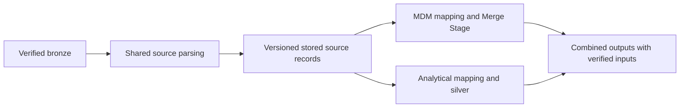

# Shared parsing with independent MDM and analytical mappings

Status: Q1–Q6 accepted individually; complete shared-understanding check pending.
Date: 2026-09-26. No implementation, activation or deployment is claimed.

MDM needs source evidence for identity and field decisions. Analytical silver
needs source facts shaped for analytical use. Making MDM depend on the fields,
filters and availability of analytical silver limits its independence. Having
each path decode the same raw files separately avoids that dependency but repeats
processing and can produce different source readings.

The selected direction is shared, durable source parsing with independent
consumer mappings. Parse each verified artifact once per reader/version,
preserve the structured source facts, then let each consumer apply its own rules.

## The six decisions

1. **Independent progress.** MDM and silver have separate progress and retries.
   A failed consumer does not undo the other's valid commit. Combined outputs
   wait for their required coverage and compatible input versions.
2. **Shared parsing.** Both consume stored source records, with separate raw
   parsing allowed as a source-specific exception when necessary. A shared
   parser failure remains a shared upstream failure for that artifact.
3. **All structured fields.** JSON, CSV and XML source records retain all fields,
   unused fields and repeated groups. The consumer mappings choose their fields,
   transformations and business meaning. Exact source bytes remain raw evidence.
4. **Bounded parsed retention.** Keep current versions and versions still needed
   by consumers, contracts, pinned runs or required replay. Release superseded
   versions only when their protection clears and replay requirements can still
   be satisfied. Existing bronze/archive retention is preserved.
5. **Selective replay.** Reading and each mapping have separate execution versions.
   A mapping change reruns only its affected consumer from suitable stored
   records. A reader change creates a new parsed version. Existing identity-rule
   approval gates continue to apply.
6. **SEC Company + GLEIF first.** Prove correctness, independent recovery,
   mapping-only reruns and actual total cost on a bounded cohort before broader
   migration. Preserve current outputs and rollback capability during the trial.

## Practical result

Adding an MDM field already present in the stored source record changes the MDM
mapping, without a raw reparse or silver rerun. An analytical filter changes
silver alone. Fixing a reader creates a new parsed version, with affected
consumers adopting that version under their own compatibility requirements.

The shared publication adds storage and a contract to operate. Savings are not
yet measured. It reduces repeated decoding on normal retries; it does not remove
MDM matching or analytical computation, and it does not guarantee that every
artifact is parsed only once forever.

This changes the proposed Source Contract's responsibility: MDM maps from source
records independently of the analytical projection. One authoring document may
still present the reading and both mappings; the execution versions follow their
actual dependencies. The existing Source Contract specification and glossary
need an explicit amendment during specification work.

The [proposed specification](specification.md) defines the proof behavior and
engineering gates. [Decisions](decisions.md) preserve each reply and time.
[Research](research/2026-09-26-primary-sources.md) supplies the external rationale.
