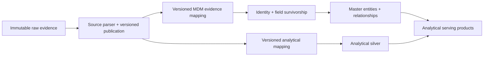

# MDM and analytical silver: primary-source research

Researched: 2026-09-26. Status: architecture research and recommendations; no implementation, deployment, or runtime acceptance is claimed. Scope: the existing AWS/S3 and Snowflake/dbt direction. Only primary sources are cited; vendor examples describe their products and are not universal architectural rules.

## Answer

**Recommendation / inference:** Keep MDM's evidence interpretation, entity routing, identity resolution, survivorship, and completion independent of analytical silver's modeling decisions. This does **not** require parsing every raw file twice. The strongest default candidate is a shared, source-faithful, versioned parse publication with separate MDM and analytical mappings. Retain immutable raw evidence so a parser defect or newly required source field can be recovered by reparsing. This follows the distinction between application-independent interchange formats and downstream domain translation; neither pattern requires a separate parser or service for every consumer. [Canonical Data Model, original pattern authors](https://www.enterpriseintegrationpatterns.com/patterns/messaging/CanonicalDataModel.html), [AWS anti-corruption layer](https://docs.aws.amazon.com/prescriptive-guidance/latest/cloud-design-patterns/acl.html).

**Qualification / inference:** Option 3 is suitable only if that shared publication is complete for the declared source contract. A filtered, deduplicated, imputed, enriched, or aggregated analytical model is a different product. If a common parse cannot preserve the inputs both consumers need, allow a source-specific exception with separate extraction, rather than placing incompatible business policies inside one parser configuration.

## What the sources establish

| Primary source | Documented fact | Architectural implication, explicitly an inference |
| --- | --- | --- |
| [AWS modern data architecture](https://docs.aws.amazon.com/whitepapers/latest/modern-data-architecture-rationales-on-aws/modern-data-architecture.html) | AWS distinguishes raw source-format storage for audit/reproducibility, standardized data, centrally governed conformed entities, and an enriched logical layer combining conformed entities with standardized raw data. | A layer name alone cannot determine whether its contents are safe MDM evidence; a shared standardized publication and separate consumer products are compatible with these distinctions. |
| [Snowflake DCM pipeline guide](https://www.snowflake.com/en/developers/guides/build-data-pipelines-with-snowflake-dcm-projects/) | Its example silver tables clean, filter, and transform raw data; gold contains analytical aggregations. | Depending on this example's silver may inherit analytical filtering. The guide is one pipeline example, not a mandate that MDM consume analytical silver. |
| [Ataccama MDM Model](https://docs.ataccama.com/mdm/latest/product-overview/mdm-model.html) | Ataccama separates source-instance and master models: instances correspond one-to-one with source records and retain source and cleansed forms; masters follow matching and merging. Logical layers can occupy the same physical table. | MDM input evidence and mastered output have different contracts; logical separation does not imply physically separate services, repositories, or databases. |
| [Informatica MDM 10.5 Overview, batch processing](https://docs.informatica.com/content/dam/source/GUID-1/GUID-18D21DFF-9100-4A76-A5CD-0D6CA47FEA98/22/en/MDM_105_OverviewGuide_en.pdf) | Its documented flow lands source data, stages/cleanses it, loads base objects, matches, consolidates, and publishes; the landing process can be an external ETL tool or application. | An MDM-owned preparation path is established practice. That does not establish that the source must be parsed twice or that an analytical warehouse is prohibited upstream. |
| [Informatica MDM 10.4 HF1 Overview, XREF and history](https://docs-test.informatica.com/content/dam/source/GUID-1/GUID-18D21DFF-9100-4A76-A5CD-0D6CA47FEA98/21/en/MDM_104HF1_OverviewGuide_en.pdf) | XREF records retain source-system identity, source primary key, and contributed values; history supports tracing changes. XREFs support unmerge and source-contribution deletion. | Keeping independent contributions and lineage matters for corrections; a flattened winning-value-only analytical row is insufficient evidence for reversible mastering. This cited edition is older product documentation, not a claim about current SaaS behavior. |
| [Profisee golden-record guide](https://profisee.com/blog/what-is-a-golden-record/) | Profisee describes ingestion, matching, organization-defined survivorship, validation, publication, and maintenance. Its MDM medallion terminology calls processed/mapped data silver and mastered records gold. | A vendor's use of “silver” or “gold” can describe MDM's own preparation/output, rather than the analytics layers bearing those names. |

These documents show multiple useful decompositions. **Research limitation:** They do not establish a universal rule that MDM must follow analytical silver, must bypass all shared preparation, or must have its own raw parser. The topology recommendation below is a synthesis, not a vendor requirement.

## Compare the three designs

All entries in this comparison are architectural analysis / inference, grounded in the distinctions above rather than measured performance claims.

| Design | Flexibility and correctness | Operational/cost tradeoffs | When reasonable |
| --- | --- | --- | --- |
| **1. Raw → analytical silver → MDM** | MDM depends on silver's fields, record grain, filters, deduplication, null interpretation, timeliness, and history. An MDM-only mapping change is independent only while silver supplies all needed evidence. | Shares extraction and preparation, but an upstream silver failure or incompatible change delays MDM; coordinating silver migrations becomes part of mastering maintenance. | Silver is a governed source-evidence interface with versioned contracts, sufficient provenance/history, and an MDM-compatible SLA. If so, it is substantively a shared source publication despite its name. |
| **2. Raw → MDM parser; raw → silver parser** | Each consumer controls extraction and interpretation. No requirement to fit a common schema. Source interpretation can drift when two implementations decode the same identifiers, dates, repeats, or amendments differently. | Repeated raw reads/decoding plus duplicate maintenance and validation; costs depend on source size, parser cost, and deployment. Sharing a parser library still leaves two processing executions. | Consumers need incompatible extraction capabilities, independent parser rollout or failure domains, or a common publication costs more than it saves. Do not assume two parsers are automatically safer. |
| **3. Raw → shared source parse → MDM mapping and analytical mapping** | One interpretation of source syntax; independent business semantics and mapping versions. Parser/publication failures remain shared upstream failures. Missing evidence requires a new parse version, not merely remapping. | Adds retained parse storage, publication manifests, compatibility work, and two consumer reads; can avoid repeated expensive decoding. Net savings require measurement. | A source-faithful contract can support both domains, parsing is reusable, and consumer retries/backfills/completion are independent. Recommended default, conditional on evidence-preservation tests. |

**Recommendation / inference:** Keep source observations available even when consumers can use mastered entities downstream. A serving product that combines silver facts with MDM dimensions should pin or record the versions it joined; it should not silently rewrite source observations to match today's master identity.

## Logical, code, process, and deployment separation

AWS's anti-corruption layer translates differing domain semantics and can be implemented as an in-application class or independent service. Its tradeoffs include operational overhead, latency, bottlenecks, and a new failure point. This supports treating semantic boundaries and deployment boundaries as separate choices. [AWS anti-corruption layer](https://docs.aws.amazon.com/prescriptive-guidance/latest/cloud-design-patterns/acl.html).

**Recommendation / inference:** Start with distinct contracts and ownership: source decoding, MDM evidence adaptation, analytical shaping, and mastering. They can share a repository, library, image, or initial job while the architecture is proven. Separate runtime processes/deployments when scheduling, capacity, credentials, rollout, or failure isolation justify them. A single job with two independently recoverable consumers can be logically decoupled; two services that share mutable completion state or demand simultaneous schema upgrades remain coupled.

The source parser should interpret a **source's structure and documented values**. The MDM mapper chooses domain meaning, routes, and evidence fields; mastering chooses identities and surviving values. The analytical mapper chooses analytical grain, joins, filters, types, derived columns, and history. **Recommendation / inference:** Share a deterministic utility where both consumers intentionally want identical behavior, but give business policies explicit owners and versions. Do not equate “two configurations” with “two raw parses”: two mappings can consume the same stored parse without reopening raw bytes.

**Implementation distinctions / inference:** A shared parser library can still run twice. In-memory fanout can decode once and feed two consumers during one execution, but after process loss a retry must reconstruct that parse unless it was durably retained. A committed parsed publication lets consumers retry or replay their mappings without reparsing raw input. These are progressively different guarantees; code reuse alone does not establish independent replay. Raw bytes remain the exact evidence; the parsed publication is source-faithful only within its declared contract. Do not claim arbitrary future mapping independence while dropping unknown fields or source distinctions.

## Required publication and version contracts

AWS Glue Schema Registry documents producer/consumer schemas with version IDs and compatibility modes. Its documented integrations target streaming applications; it is evidence for the contract principle, not a recommendation to add Glue Schema Registry to this batch platform. [AWS schema registry](https://docs.aws.amazon.com/glue/latest/dg/schema-registry.html), [How schema registry works](https://docs.aws.amazon.com/glue/latest/dg/schema-registry-works.html).

dbt contracts enforce returned column names and types; content validation is handled by tests. Model contracts do not automatically apply to dbt sources, snapshots, or Python models. Model versions permit pinned downstream references and migration windows, while dbt explicitly recognizes that a logic change can alter results without changing a structural contract. [dbt model contracts](https://docs.getdbt.com/docs/mesh/govern/model-contracts), [dbt model versions](https://docs.getdbt.com/docs/mesh/govern/model-versions).

**Proposed design requirements / inference:**

- Identify the dataset/provider, raw publication/object and immutable object version or content digest, source record key/location, source effective time, capture time, operation/snapshot semantics, and lineage links. Separate a source identifier from a mastered entity ID.
- Record the source-contract version, parser implementation/dependency version and configuration digest, parse-publication ID, and any auxiliary-input identities. If extraction depends on another captured file or classification table, include its version in the parse identity; raw-file identity alone is insufficient.
- Preserve original lexemes where normalization could change meaning, repeated values and relationships, source identifiers including leading zeros, absent versus explicit null versus empty values, and errors/unknown fields. Retain raw bytes; “lossless” must have a declared, testable scope and does not mean every possible future semantic question is already answered.
- Publish a complete immutable manifest atomically as the visibility boundary, with object digests, record counts, reject/quarantine dispositions, and source coverage. Readers should pin this manifest rather than discover a changing directory as their input set.
- Version MDM mapping, analytical mapping, and mastering policies independently. A structurally compatible schema change can still be semantically breaking; test interpretation and consumer outcomes, not just field types.
- Define how consumers pin old versions, adopt new versions, and retire versions. Materializing every historical parse/mapping version forever is not required; retain enough artifacts and executable dependencies to meet the declared replay horizon.
- Assign ownership for source-contract changes, evidence retention, correction notices, and consumer migration. Sharing an upstream publication moves this coordination to an explicit interface; it does not eliminate source authority decisions or lifecycle costs.

The canonical publication should be **source-aligned**, not an enterprise-wide master entity schema in disguise. The original Canonical Data Model pattern introduces a common application-independent format to reduce integration dependencies, but notes its overhead when few applications participate. **Inference:** use that indirection at the smallest useful source-contract boundary; a universal canonical schema would reintroduce coordination pressure if every new source or domain had to change it. [Canonical Data Model](https://www.enterpriseintegrationpatterns.com/patterns/messaging/CanonicalDataModel.html).

## Failure isolation, replay, and completion

S3 event notifications are delivered at least once. AWS Glue bookmarks can rewind/reset source processing but do not clean target files. Neither capability by itself guarantees idempotent target writes or an independent consumer checkpoint. [S3 event notifications](https://docs.aws.amazon.com/AmazonS3/latest/userguide/EventNotifications.html), [AWS Glue bookmarks](https://docs.aws.amazon.com/glue/latest/dg/monitor-continuations.html).

Snowflake streams hold offsets, not a durable copy of change data; a DML transaction advances an offset, and retention expiry can make unconsumed changes inaccessible. Standard streams represent net changes between offsets rather than a complete event history; insert-only streams on external files do not report removed or overwritten-file deletions. [Snowflake streams](https://docs.snowflake.com/en/user-guide/streams-intro).

Snowflake dynamic-table pipelines coordinate snapshot-consistent refreshes; an upstream failure prevents downstream advancement. A refresh boundary gives scheduling independence but can expose stale upstream input while the downstream refresh reports success. [Snowflake pipeline consistency and boundaries](https://docs.snowflake.com/en/user-guide/dynamic-tables/data-consistency).

**Proposed design requirements / inference:**

1. Track captured, parse-published, MDM-applied, analytics-applied, and serving-published outcomes separately. “Parsed” is not “mastered”; “analytics refreshed” is not “all required consumers completed.”
2. Give each consumer its own receipt/checkpoint keyed by immutable input publication and consumer version. Commit its target effect and corresponding receipt together where possible; if crossing storage systems, define an idempotent recovery protocol rather than claiming atomicity.
3. A failed MDM application must not force analytics to reapply a successful batch, or vice versa. A parser defect can affect both: publish a corrected parse version and replay each affected consumer independently.
4. For a mapping-only correction, replay the relevant consumer from the pinned parse. For a parser correction/newly required field, reparse raw evidence into a new publication. For exact historical reproduction, retain the old input scope and all relevant parser, auxiliary-input, mapping, and policy identities.
5. Report per-consumer coverage and freshness. If a business workflow requires both domains at one input watermark, its completion is the conjunction of both durable receipts; decoupled jobs do not remove that requirement.

## Corrections, amendments, and deletion

S3 Object Lock protects specific object versions; it does not prevent creating newer versions or adding delete markers. Therefore reading the current value of an object key is not equivalent to reading frozen evidence. [S3 Object Lock](https://docs.aws.amazon.com/AmazonS3/latest/userguide/object-lock.html).

Ataccama supports reprocessing/rematching with different policies for preserving manual decisions. Its treatment of inactive source records is configurable and can remove them from consolidation. These are product examples of identity and deletion policy being distinct from source decoding. [Ataccama matching and identity changes](https://docs.ataccama.com/mdm/latest/matching/working-with-matching.html).

**Proposed design requirements / inference:** Declare append, amendment, replacement snapshot, explicit deletion, and retraction semantics per dataset. Do not infer source deletion from absence in a partial/failed snapshot. Keep a tombstone or retraction identity and its affected source contribution when appropriate. Withdraw the contribution, recompute surviving fields and relationships, and record any identity split/unmerge policy; independently adjust analytical facts/history under that consumer's policy. Preserve correction lineage without erasing prior evidence. A parser fix is a new interpretation of the same source publication, while a source amendment is new evidence: do not collapse the two into one undifferentiated update.

## Decision criteria

**Recommendation / inference:** Choose option 3 if one bounded source parse can demonstrably preserve the evidence needed by both consumers and supports pinned publication replay. Choose option 2 for a specific source when evidence needs or rollout/failure requirements cannot be satisfied by that boundary. Keep option 1 only when its “silver” is contractually source evidence rather than an analytics-owned mutable business model.

Before committing to a rebuild, verify one representative difficult source against: record/grain preservation; raw-to-parse provenance; independent mapping changes; parser-version correction; complete versus partial snapshots; retractions; crash-after-target-write recovery; and independent consumer completion. Measure parse CPU/raw I/O, publication storage/read cost, and operational work. These are proposed acceptance criteria, not results from this research.
