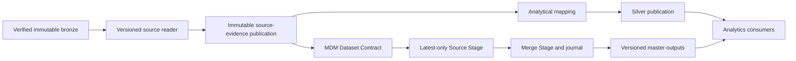

# MDM and silver: repository assessment

Date: 2026-09-26. Reviewed base: `2b52b2913d12679df3651bc5cd3e05b125abc403`.
Status: research and recommendation, **not an accepted architecture decision**.
No runtime code, contract, retention policy or production deployment is changed.

Refresh, 2026-09-26 10:54 ET: branch rebased onto `3ea3a6b1` after PRs #720 and
#721 merged. PR #720 now carries `countryCode` into the address projection and
Company matching; the omission below is a historical example on the reviewed
`2b52b291` base, **not an open defect on refreshed main**. The reader remains
dependent on the silver projection schema. PR #721's CIK safety work is outside
this architecture research and its implementation has not been reviewed here.

## Answer

For this platform's flexibility goal, MDM should own its interpretation,
matching, field selection, progress and replay independently of analytical
silver. That does **not** require two implementations of raw parsing or two
raw-file parses on every delivery. Recommended direction: publish verified,
versioned source evidence once, then let MDM and analytical silver consume it
through independent mappings. The external basis and limitations are in
[the primary-source research](2026-09-26-primary-sources.md).

This is an architectural inference, not a universal rule from a vendor.

## What exists on the reviewed main

| Observation | Evidence | Meaning |
| --- | --- | --- |
| SEC Company preparation consumes a `silver_landing` manifest and Parquet members, including company, filings, address and a separate ticker capture. | [company_source.py](../../../edgar_warehouse/mdm/clean/company_source.py), lines 175–212 and 408–455 | It avoids a dependency on querying published Snowflake silver for this bounded path, but remains dependent on silver's projection schema and capture inputs. |
| SEC's address projection keeps `stateOrCountry` and its description, but omits `countryCode`. Company matching derives country from the retained state field; its comment names Shell as a missing-country example. | [bronze_submission_extractors.py](../../../edgar_warehouse/loaders/bronze_submission_extractors.py), lines 92–119; [company_source.py](../../../edgar_warehouse/mdm/clean/company_source.py), lines 246–269 | The evidence needed by MDM can be lost before MDM receives it. Ticket 14 is an active follow-up, not proof the omission is already repaired on this base. |
| Native GLEIF has a bounded source reader and then a Dataset Contract mapping. Its batches carry bronze references and freeze mapping versions. | [gleif_source.py](../../../edgar_warehouse/mdm/clean/gleif_source.py), lines 1–29 and 102 onward; [native_consumption.py](../../../edgar_warehouse/mdm/clean/native_consumption.py), lines 221–279 | Inputs already differ by source. Neither a universal silver dependency nor a generic parse publication is implemented across all domains. |
| The Source Contract specification is proposed; it requires `read` columns to equal `silver` columns, and `dataset.table` names a silver table. Production commands are specifications, not an implemented generic runner. | [Source Contract specification](../../../docs/specs/source-contract/spec.md), status and §§12, 13, 18; [prototype runner](../../source-contract/prototype/engine/source_engine.py), lines 868–893 | The prototype demonstrates reuse of parsed rows; it does not yet separate a source-evidence contract from an analytical projection. Calling those rows "silver" does not settle their responsibility. |
| The MDM adapter takes an ordinary record, contract and pinned publication; it need not query a silver database itself. | [adapters.py](../../../edgar_warehouse/mdm/clean/adapters.py), lines 195–214 | This is a useful existing seam. Keep it unless the new evidence contract demonstrates a specific interface gap. |
| The existing publication verifier rejects derived reinterpretations until a lineage-verification contract exists. | [source-publications.md](../../../docs/specs/clean-mdm/source-publications.md), Verification and permissions | A parsed publication cannot simply be passed as if it were a captured publisher archive. Its lineage, hashes and completeness must be designed and verified. |

These are source-code observations. No deployed-path claim or throughput result
is inferred from them. Historical MDM pipeline code still describes reading
silver; it must be inventoried separately before any whole-platform migration.

## Options

| Option | Flexibility | Parsing and storage | Main liability |
| --- | --- | --- | --- |
| A. MDM consumes analytical silver | Low if analytics chooses fields, filtering or collapse. Can work when silver is deliberately a faithful source contract. | Usually one raw parse; reuses stored tables. | Analytical schema, availability and interpretation constrain MDM. Renaming this table does not remove the dependency. |
| B. Each consumer parses bronze independently | Strong consumer control, including different parser versions. | Usually two parses when both consume the same bytes; shared parser code can reduce maintenance but not duplicate execution. No new parsed store required. | Repeated I/O/decoding and potentially divergent source readings. Sometimes justified for different semantics or tiny files. |
| C. Shared source-evidence publication, independent mappings | Independent MDM/analytics policy and output evolution within the evidence retained by that publication. | One raw parse per immutable input and parse version; two necessary mapping passes; extra parsed write and consumer reads. | Shared reader defects affect both. Adds a publication contract, retention and compatibility burden. Changes needing omitted evidence require a new parse. |

Recommend C as the target, subject to proving its fidelity and recovery. Preserve
B as an explicit exception for a source whose two interpretations cannot share
an adequate read contract. Do not add a new service just to achieve separation;
logical boundaries can exist in one codebase and deployment.

## Proposed shape

The publication represents source facts, not a selected master record or an
analytics-friendly filtered table. It can use source-shaped documents or
parent/child tables; format and physical placement remain design gates. Exact
source bytes remain bronze. "Lossless" here means preserving the declared
evidence and distinctions; it does not imply byte-reversible JSON/XML encoding.

One authoring Source Contract can still contain shared reading rules and two
consumer mapping blocks. Two responsibilities do not mandate two files. Their
execution fingerprints should be separate, while approval of an identity-changing
version must bind the full dependency set that can affect the decision.

## Contracts required before implementation

1. **Evidence fidelity.** Preserve source record identity, publication/sequence,
   original identifiers and names, repeating groups with order/locators, field
   presence, explicit null and deletion signals, source-effective versus observed
   times, and raw object/hash. Do not perform identity deduplication, survivorship
   or analytical filtering in this shared step. Decide how unknown fields are
   retained; otherwise arbitrary future mappings cannot be promised.
2. **Independent versions.** Pin raw hashes and the reader/read-contract/schema
   versions plus lookup snapshot hashes. MDM mapping, analytical mapping and
   Mastering Policy get their own versions. A mapping-only change reuses suitable
   retained evidence; a decoder/schema change or newly needed omitted field reparses
   the affected bronze. Never use a changing "latest" lookup for historical replay.
3. **Publication, delivery and commits.** Publish a bounded immutable manifest
   only after its expected partitions/counts/hashes and rejects are accounted
   for. Each consumer records its own idempotency key, checkpoints and durable
   output intent in its transaction. There is no atomic transaction spanning S3,
   Snowflake and MDM Postgres. Retries reconcile missing receipts after commits.
4. **Failure independence.** Silver publication failure must not roll back a
   valid MDM commit; MDM deferral/failure must not roll back valid silver.
   Overall completion and any combined serving output still require the declared
   consumer coverage and compatible watermarks. A parser failure can block both
   for that artifact; independence cannot remove a shared prerequisite.
5. **Corrections and retirement.** Source sequences and explicit coverage govern
   corrections, late arrivals, retractions and retirement. Missing rows in a
   filtered analytical table never authorize MDM deletion. Rule-based correction
   uses the current Stage under the accepted Company contract; investigation of
   an old decision uses its compact receipt and pinned evidence.
6. **Retention.** The shared publication is derived evidence, not a new history
   in the MDM journal. Define cache retention/rebuild and whether lagging consumers
   pin partitions. Existing SEC bronze retention and new-enrichment archive/delta
   retention differ; this proposal supersedes neither. If required bytes and
   parse evidence have both been retired, exact historical replay is unavailable.
7. **Compatibility and migration.** Revise the Source Contract specification's
   current `dataset.table`/silver coupling and build derived lineage verification.
   Preserve stable `source_code` and source keys. Keep pipeline entry points,
   old readers and rollback outputs during a bounded parity trial. Do not move
   all entity pipelines as a side effect of this research.

## Cost question: no measured answer yet

Processing each source once is not the same as doing all work once: MDM matching
and analytical transformation remain distinct computations. For a source, compare:

- independent paths: two raw reads/decodes plus the two consumer mappings;
- durable shared parse: one raw read/decode, parsed write, two parsed reads,
  and the same two consumer mappings.

The second wins only if saved repeated decode/replay work exceeds its write,
read and operating costs. Small submissions JSON and multi-gigabyte GLEIF or
filing archives can have different answers. No latency, cost percentage or
storage savings is measured by this note. Measure a representative bounded
SEC/GLEIF cohort, then larger parse-heavy files, preserving exact input/version
identity, row/reject parity, recovery and validated-output cost.

## Review and decision frontier

GoF review: the existing record-to-assertion adapter and bounded record readers
are appropriate seams. History shows repeated Company evidence/provenance changes
(`4e281666`, `0df0be28`, `7d515861`); this justifies inspecting the interface,
not replacing it with Bridge/Strategy classes. Keep plain functions/iterators.
A new parsed-publication interface costs fidelity validation and an additional
debugging hop. The concrete issue to solve is evidence being selected out before
MDM, not a missing design-pattern class.

Recommended interview route from ask-matt: research → grill-with-docs → accepted
ADR/spec → tickets. One question at a time, following the operator's preference.
First settle the required independence: should each consumer continue when the
other's publication fails? Then settle the common evidence boundary, retention,
version/replay and migration requirements. No accepted ADR is written yet.
