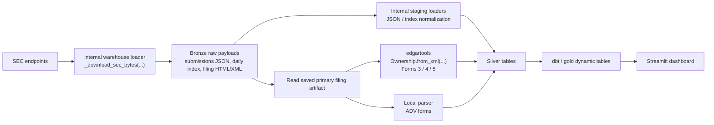

# edgartools-platform

Data platform for SEC EDGAR built on [edgartools](https://github.com/dgunning/edgartools).

Extracts SEC EDGAR filing data from source through bronze object storage to a gold analytics layer. Terraform now separates passive AWS/Azure/Snowflake provisioning from access-control roots; workload jobs, image rollout, secret values, schema migrations, and analytics refreshes run through explicit operator actions.

AWS application rollout is handled by `infra/scripts/deploy-aws-application.sh`
after the AWS provisioning and access Terraform roots have been applied. That
script builds/pushes the warehouse image when requested, registers ECS task
definitions, and deploys Step Functions outside Terraform.

AWS uses three principal classes. An admin profile applies the Terraform roots.
`sec_platform_deployer` deploys images, task definitions, state machines, and
starts executions. Runtime runs as service-assumed runner roles:
`sec_platform_runner_execution`, `sec_platform_runner_task`, and
`sec_platform_runner_step_functions`; no runner IAM user or long-lived runner
access key is part of the normal path.

## Architecture

```
SEC EDGAR API → edgar-warehouse (Python) → S3 or ADLS Gen2 (Parquet) → Snowflake or Databricks source tables → dbt → Gold tables → dashboard
```

### Where `edgartools` fits

This repo is still being run in development. The diagram below shows the current warehouse runtime code path that runs in dev today. Raw SEC files are downloaded by the repo's own loader; `edgartools` is used later, after the primary filing artifact has already been saved, to parse ownership filings into silver-layer rows.



## Quick Start

See [docs/runbook.md](docs/runbook.md) for complete end-to-end setup.
For MDM graph configuration, see [docs/neo4j.md](docs/neo4j.md).

## Structure

| Directory | Purpose |
|---|---|
| `edgar_warehouse/` | Python ETL runtime — exports SEC data to object storage |
| `infra/terraform/` | Passive AWS/Azure/Snowflake provisioning roots plus separate access-control roots |
| `infra/snowflake/dbt/` | dbt project for Snowflake and Databricks gold tables |
| `infra/databricks/sql/` | Unity Catalog external table registration templates |
| `infra/snowflake/sql/bootstrap/` | Bootstrap SQL for Snowflake native S3 pull |
| `infra/snowflake/streamlit/` | Streamlit-in-Snowflake production dashboard |
| `scripts/batch/` | Batch processing scripts for individual form types |
| `examples/dashboard/` | Standalone Streamlit dashboard |

## Dependencies

This platform requires `edgartools` (the core SEC library):
```bash
pip install "edgartools>=5.29.0"
```

The editable project install below also brings in the pinned `edgartools` dependency from `pyproject.toml`.

## Where `edgartools` Is Used

The `edgartools` package is a required dependency for part of the warehouse parser layer and for the batch smoke-test scripts in `scripts/batch/`. It is not vendored in this repository and should be installed from PyPI.

This section describes the code paths used by the warehouse runtime in development today. It does not imply that this repo is already deployed to a live production environment.

### Warehouse runtime usage

| `edgartools` surface | How this repo uses it | Files |
|---|---|---|
| `edgar.ownership.Ownership` | Parses already-downloaded primary filing content for Forms 3, 4, and 5 into normalized owner, derivative, and non-derivative transaction rows that are merged into silver. Raw SEC download and bronze persistence happen earlier in the runtime and are not handled by `edgartools`. | `edgar_warehouse/runtime.py`, `edgar_warehouse/parsers/ownership.py` |

### Batch and smoke-test usage

| `edgartools` surface | How this repo uses it | Representative files |
|---|---|---|
| `get_filings`, `Filing`, `filing.obj()`, `company.get_filings()` | Pulls filing samples across forms and years, then materializes filing objects for validation and exploratory parsing. | `scripts/batch/batch_filings.py`, `scripts/batch/batch_test_filing_header.py`, `scripts/batch/batch_insiders.py`, `scripts/batch/batch_company_filings.py` |
| `edgar.ownership.Ownership` | Validates insider ownership parsing, dataframe conversion, and HTML rendering for Forms 3/4/5. | `scripts/batch/batch_insiders.py`, `scripts/batch/query_form4.py` |
| `Entity`, `Company`, `get_cik_lookup_data` | Resolves companies and tests company/entity lookup flows. | `scripts/batch/batch_entity.py` |
| `EntityFacts`, `EntityFactsParser`, `download_company_facts_from_sec`, `load_company_facts_from_local` | Loads and parses company facts datasets for entity-facts validation. | `scripts/batch/batch_entity_facts.py` |
| `popular_us_stocks`, `get_company_tickers` | Builds representative ticker samples for batch runs. | `scripts/batch/batch_company_filings.py`, `scripts/batch/batch_management_discussions.py`, `scripts/batch/batch_entity_facts.py` |
| `edgar.xbrl.XBRL` and related XBRL helpers | Parses financial statements from 10-Q and 10-K filings and tests XBRL stitching flows. | `scripts/batch/batch_financials_10Q.py`, `scripts/batch/batch_quarterly_xbrl.py`, `scripts/batch/batch_test_xbrl.py`, `scripts/batch/batch_xbrl_stitching.py` |
| `edgar.legacy.xbrl.XBRLAttachments` | Extracts legacy/non-financial XBRL attachments from filing documents. | `scripts/batch/batch_non_financial_xbrl.py` |
| `edgar.documents.parse_html`, `edgar.documents.config.ParserConfig` | Parses 8-K HTML filings and validates section-detection behavior. | `scripts/batch/batch_8k_section_detection.py` |
| `edgar.company_reports.EightK` | Materializes 8-K/6-K report objects from filings for validation. | `scripts/batch/batch_eightk.py` |
| `edgar.offerings.prospectus.*` | Experiments with prospectus parsing for 424B filings. | `scripts/batch/batch_424B.py` |
| `use_local_storage` | Enables local cached storage for repeatable SGML/XBRL batch runs. | `scripts/batch/batch_sgml.py`, `scripts/batch/batch_test_xbrl.py`, `scripts/batch/batch_xbrl_stitching.py`, `scripts/batch/batch_entity_facts.py` |

### Practical notes

- Raw SEC downloads and bronze writes are handled by this repo's own loader code in `edgar_warehouse/runtime.py` and `edgar_warehouse/artifacts.py`, not by `edgartools`.
- In the warehouse runtime, `edgartools` currently enters at the ownership parsing step after the primary artifact has already been downloaded and stored.
- The current warehouse runtime dependency is `edgar.ownership.Ownership` for Forms 3/4/5. ADV parsing is handled by the local parser in `edgar_warehouse/parsers/adv.py`.
- Most other `edgartools` usage in this repo lives in `scripts/batch/` and functions as smoke coverage for filings, entity data, documents, and XBRL parsing.
- The standalone dashboard in `examples/dashboard/` does not import `edgartools`; it reads already-modeled Snowflake gold tables.
- When bumping the `edgartools` version, rerun the batch scripts to confirm that the library surfaces above still behave as expected.

## Installation

```bash
git clone https://github.com/paulananth/edgartools-platform
cd edgartools-platform
pip install -e ".[s3,snowflake]"
# Azure/Databricks parallel-run install:
# pip install -e ".[azure,databricks]"
```

Azure runtime credentials use managed identity for ACR/ADLS and Azure Key Vault for
the mandatory SEC EDGAR User-Agent identity plus optional Databricks/dbt settings.
Use `infra/scripts/bootstrap-azure-secrets.sh` to populate those values outside
Terraform state.
