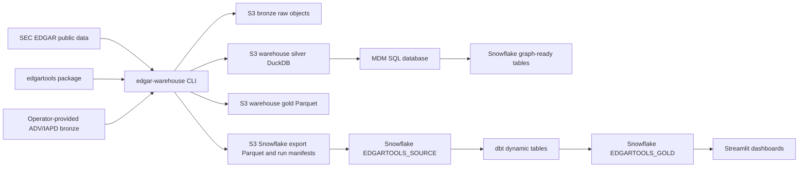

# EdgarTools Platform Data Architecture

This document describes the current AWS-focused data architecture in this
repository. It identifies each pipeline, the data points it creates, and
whether source data is fetched directly from SEC/public systems, mediated
through the `edgartools` package, supplied by an operator, or derived inside
the platform.

## Scope

The active path is:

```text
SEC EDGAR and approved external source files
  -> edgar-warehouse CLI and AWS Step Functions
  -> S3 bronze raw objects
  -> DuckDB silver state in S3 warehouse storage
  -> MDM PostgreSQL or Snowflake Postgres control/master data
  -> gold Parquet and Snowflake export Parquet in S3
  -> Snowflake EDGARTOOLS_SOURCE native S3 pull
  -> dbt EDGARTOOLS_GOLD dynamic tables
  -> Streamlit dashboards and graph-ready Snowflake tables
```

The repository contains a few non-active or compatibility code paths, but this
document covers the AWS/S3/Snowflake path only.



## Source Modes

| Mode | Meaning | Current examples |
| --- | --- | --- |
| Direct SEC fetch | The repository builds an SEC URL and downloads bytes itself using the repo HTTP client or `urllib`. | Company ticker JSON, submissions JSON, daily form indexes, direct primary filing documents, XBRL companyfacts. |
| edgartools-mediated | The repository delegates lookup or parsing to the `edgartools` package. The original source remains SEC EDGAR unless noted. | `edgar.get_by_accession_number`, `edgar.get_company_tickers`, `Ownership.from_xml`, `EarningsRelease`, proxy summary compensation extraction, 13F information table parser. |
| Operator-provided | Data or credentials must already exist in configured local/S3/secret storage. | ADV/IAPD bronze XML, MDM DSN, Snowflake credentials, AWS secrets. |
| Local parser or computation | The platform parses cached source bytes or computes derived metrics without another external source call. | ADV parser, text projection, XBRL fact normalization, financial derived metrics, accounting scores, MDM relationship derivation. |
| Internal derived storage | Data created from prior platform layers. | Silver DuckDB tables, gold Parquet, Snowflake source/gold tables, Streamlit dashboards. |

## Storage Layout

All runtime paths are validated through `edgar_warehouse/config/warehouse_paths.properties`.

| Layer | Canonical paths | Purpose |
| --- | --- | --- |
| Bronze reference | `reference/sec/company_tickers/{date_path}/company_tickers.json`, `reference/sec/company_tickers_exchange/{date_path}/company_tickers_exchange.json` | SEC ticker snapshots used to seed company/ticker scope. |
| Bronze CIK batches | `reference/cik_universe/runs/{run_id}/cik_batches.jsonl`, `cik_windows.jsonl`, `cik_snapshot.jsonl`, `run-summary.json` | Batch/window inputs and run summaries for Step Functions. |
| Bronze submissions | `submissions/sec/cik={cik}/main/{date_path}/CIK{cik}.json`, `submissions/sec/cik={cik}/pagination/{date_path}/{document_name}` | SEC submissions main and pagination JSON. |
| Bronze daily index | `daily_index/sec/{date_path}/form.{business_date}.idx` | SEC daily form index text files. |
| Bronze filing artifacts | `filings/sec/cik={cik}/accession={accession_number}/primary/{document_name}`, `.../attachments/{document_name}` | Primary documents and attachments for parser input. |
| Text projections | `text/sec/cik={cik}/accession={accession_number}/{text_version}.txt` | Normalized text extracted from cached filing artifacts. |
| Silver | `silver/sec/silver.duckdb`, `silver/sec/shards/shard-{shard_index}.duckdb` | DuckDB staging and serving state, including Branch A and Branch B tables. |
| Gold Parquet | `gold/{table_name}/run_id={run_id}/{table_name}.parquet` | Warehouse-local gold Parquet outputs. |
| Snowflake export | `{table_path}/business_date={business_date}/run_id={run_id}/{table_path}.parquet` | S3 package consumed by Snowflake native pull. |
| Snowflake manifest | `manifests/workflow_name={workflow_name}/business_date={business_date}/run_id={run_id}/run_manifest.json` | Per-run table list, row counts, and paths for Snowflake loading. |

Remote storage is intentionally restricted to `s3://` by
`edgar_warehouse/infrastructure/object_storage.py`.

## Pipeline Inventory

Status labels (one per pipeline, per the data-architecture review): **Automated**
— runs unattended inside a deployed AWS Step Functions workflow; **Prerequisite**
— must be satisfied (automated or manually) before other automated steps will
work correctly; **Manual/backfill-only** — has no automated trigger today, an
operator runs it directly; **Optional/validation** — automated but not required
for the pipeline it's attached to, or exists purely to check state.

| Pipeline | Status | Entry points | Source access | Main data points | Outputs |
| --- | --- | --- | --- | --- | --- |
| Reference snapshot and warehouse CIK batching | Automated | `edgar-warehouse seed-universe` | Direct SEC fetch of `company_tickers.json` and `company_tickers_exchange.json`. | CIK, ticker, exchange, source rank, source checkpoint, company sync state. | Bronze reference JSON, `sec_company_ticker`, `sec_company_sync_state`, `cik_batches.jsonl`, optional Snowflake `TICKER_REFERENCE` export. Automated in AWS workflows (`load_history`, `bootstrap_batched`, others) as a bronze/reference prerequisite. Seeds warehouse CIK tracking in `sec_company_sync_state`; writes no MDM state. |
| MDM tracked-universe seeding | Automated + Prerequisite | `edgar-warehouse mdm seed-universe` | edgartools-mediated `edgar.get_company_tickers()`. | CIK, ticker, exchange, MDM entity shell, tracking status. | `mdm_entity`, `mdm_company`. Used by explicit MDM workflows and the MDM chain; warehouse bootstrap scope comes from `sec_company_sync_state`. |
| Window computation | Automated | `compute-windows`, `write-run-summary` | Silver `sec_company_sync_state` CIK list and prior bronze window files. | Window offset/limit, CIK snapshot, window count, CIK count. | `cik_windows.jsonl`, `cik_snapshot.jsonl`, `run-summary.json`. |
| Submissions bootstrap | Automated | `bootstrap`, `bootstrap-full`, `bootstrap-next`, `bootstrap-batch` | Direct SEC submissions JSON unless cached bronze is available. Scope comes from explicit CIKs or silver `sec_company_sync_state.tracking_status`. | Company profile, addresses, former names, submission pagination files, filing metadata. | Bronze submissions JSON, `sec_company`, `sec_company_address`, `sec_company_former_name`, `sec_company_submission_file`, `sec_company_filing`, `sec_company_sync_state`, `discovery_checkpoint`. |
| Daily incremental | Automated | `daily-incremental`, `load-daily-form-index-for-date`, `catch-up-daily-form-index` | Direct SEC daily form index text files; impacted CIKs then use submissions bootstrap. | Business date, source year/quarter, row ordinal, form, company name, CIK, filing date, file name, accession, TXT URL, record hash. | Bronze daily index, `stg_daily_index_filing`, `sec_daily_index_checkpoint`, `discovery_checkpoint`, then submissions and parser outputs for selected CIKs. |
| Filing artifact capture | Automated | Automatic with configured parser policies, `targeted-resync --include-artifacts` | Direct SEC primary document fast path when `primary_document` is known. edgartools `get_by_accession_number` fallback for attachment discovery/content. | Attachment sequence, document name/type/description/URL, primary flag, raw object id, content type, byte size, SHA256, fetched time, HTTP status. | Bronze filing documents/attachments, `sec_raw_object`, `sec_filing_attachment`. |
| Filing text projection | Manual/backfill-only | `targeted-resync --include-text` | Internal cached primary artifact bytes. | Source document name, normalized text SHA256, char count, extraction time. | Text file in warehouse storage, `sec_filing_text`. Only runs via the standalone `targeted_resync` Step Function (single-CIK debug/resync) — not chained into `load_history`/`bootstrap`/`daily_incremental`. |
| Ownership parsing | Automated | Automatic parser policy for Forms 3/4/5, `parse-ownership-bronze` | edgartools-mediated `Ownership.from_xml` over cached primary XML. `parse-ownership-bronze` makes no SEC calls. | Reporting owner CIK/name/roles/title, non-derivative transactions, derivative transactions, shares, price, codes, ownership nature/directness, exercise/expiration/underlying fields. | `sec_ownership_reporting_owner`, `sec_ownership_non_derivative_txn`, `sec_ownership_derivative_txn`, `sec_parse_run`. |
| ADV parsing | Manual/backfill-only | `parse-adv-bronze` | Operator-provided ADV/IAPD/FOIA bronze artifacts; local parser. ADV is not captured by normal SEC EDGAR bootstrap. | Adviser name, SEC file number, CRD/IARD number, effective date, filing status, offices, disclosures, private funds, AUM. | `sec_adv_filing`, `sec_adv_office`, `sec_adv_disclosure_event`, `sec_adv_private_fund`. No automated AWS workflow supplies ADV bronze input; an operator must place it before this can run. |
| Branch B per-filing fundamentals | Automated | `bootstrap-fundamentals --mode per-filing` | Internal cached filing artifacts, read from the unified SEC silver database after Branch A publishes filing metadata; edgartools-backed parsers for 8-K earnings and DEF 14A proxy compensation. | Earnings GAAP revenue/net income/EPS, non-GAAP/guidance flags, executive name/role/compensation components. | `sec_earnings_release`, `sec_executive_record` in SEC silver. Automated in `load_history`, sequenced to run after Branch A (`bootstrap-next`) completes for all windows, because it reads Branch A's output. |
| Branch B entity facts | Automated | `bootstrap-fundamentals --mode entity-facts` | Direct SEC `https://data.sec.gov/api/xbrl/companyfacts/CIK{cik}.json` via the shared SEC client (`edgar_warehouse/infrastructure/sec_client.py` — host allowlist, rate limit, retries; same contract as the rest of the runtime). | XBRL concept, unit, value, decimals, fiscal year/period, period start/end, form type, auditor DEI fields. | `sec_financial_fact`, `sec_accounting_flag`, `sec_financial_derived`, forensic-score updates in SEC silver. Automated in `load_history`, sequenced after Branch A because it writes the same DuckDB artifact. **Gap:** unlike every other direct-SEC pipeline in this table, the raw companyfacts JSON response is not persisted as a `sec_raw_object` bronze/audit record — only the parsed `sec_financial_fact` rows are kept. There is no bronze artifact to replay from if the parser changes; re-processing requires re-fetching from SEC. Not fixed here; flagged for a follow-up decision (see Operational Guarantees and Gaps). |
| Branch B 13F | Automated | `bootstrap-fundamentals --mode thirteenf` | Internal cached 13F information table attachment, read from the unified SEC silver database after Branch A publishes filing metadata; edgartools `parse_infotable_xml`. | CUSIP, issuer, security title/class, shares/principal, market value normalized to USD, put/call, discretion, voting authority. | `sec_thirteenf_holding` in SEC silver. Automated in `load_history`, sequenced after per-filing (same Branch A dependency and same DuckDB artifact). |
| Reconciliation and repair | Manual/backfill-only | `full-reconcile`, `targeted-resync` | Direct SEC submissions snapshot for comparison; optional artifact/text/parser refresh. | Drift object type/key, expected/actual hashes, severity, recommended action, status. | `sec_reconcile_finding`, repaired bronze/silver/parser rows when auto-heal is selected. Own standalone Step Functions (`targeted_resync`), not chained into the main load/incremental pipelines. |
| Silver shard migration and cached replays | Manual/backfill-only | `migrate-silver-shards`, `seed-silver-batches`, `seed-bronze-batches`, `silver_mdm_gold`, `bronze_seed_silver_gold` state machines | Internal silver or existing S3 bronze only; designed to avoid new SEC calls when artifact policies are skipped. | CIK batch lists, shard manifests, shard DuckDB files. | Sharded silver DuckDB, replayed MDM/gold/Snowflake exports. Operator-triggered recovery/replay tools, run on demand. |
| MDM entity resolution | Automated | `mdm run --entity-type ...` | Internal silver DuckDB or sharded reader. | Company, adviser, person, security, fund entities, source references, rule outcomes, survivorship/stewardship state. | `mdm_entity`, `mdm_company`, `mdm_adviser`, `mdm_person`, `mdm_security`, `mdm_fund`, source refs and curation tables. |
| MDM relationship derivation | Automated | `mdm derive-relationships`, `mdm load-relationships`, `mdm backfill-relationships` | Internal MDM plus silver source tables. | `IS_INSIDER`, `HOLDS`, `COMPANY_HOLDS`, `ISSUED_BY`, `IS_ENTITY_OF`, `HAS_PARENT_COMPANY`, `MANAGES_FUND`, `IS_PERSON_OF`, `EMPLOYED_BY`, `AUDITED_BY`, `INSTITUTIONAL_HOLDS`. | `mdm_relationship_instance`, graph-ready sync tables. `backfill-relationships` is the form chained into every automated MDM chain; `derive-relationships`/`load-relationships` are manual/ad-hoc entry points onto the same underlying logic. |
| MDM Snowflake export and graph sync | Automated | `mdm export`, `mdm sync-graph`, `mdm verify-graph` | Internal MDM SQL state and Snowflake connection settings. | Current MDM entity rows, graph nodes, graph edges, graph parity counts. | Snowflake MDM tables and `NEO4J_GRAPH_MIGRATION` graph-ready node/edge tables. `mdm export` is a required prerequisite for `mdm sync-graph`, not optional or manual-only: every automated AWS MDM chain (`load_history`, `bootstrap`, `daily_incremental`, `silver_mdm_gold`, `bronze_seed_silver_gold`, `mdm_gold`, `ownership_mdm_gold`) runs export immediately before sync-graph so the Snowflake MDM mirror reflects the run/backfill that just completed. `verify-graph` is validation-only (Optional/validation) — it never blocks `gold-refresh` on failure to run, only reports parity. |
| Gold build and export | Automated | `gold-refresh`, gold-affecting warehouse commands | Internal SEC silver database and shards. | Dimension keys, fact keys, filing/ownership/adviser/financial/fundamental measures. | S3 gold Parquet, S3 Snowflake export Parquet, Snowflake run manifest. |
| Snowflake native pull | Automated | `deploy-snowflake-stack.sh`, Snowflake task/procedures | S3 Snowflake export bucket through Snowflake storage integration. | Manifest inbox rows, source load status, per-table row counts, COPY/MERGE results. | `EDGARTOOLS_SOURCE` tables and `SNOWFLAKE_REFRESH_STATUS`. Deploy step (`deploy-snowflake-stack.sh`) is manual/operator-run once; the resulting Snowflake task/pipe then runs unattended. |
| dbt gold | Automated | `uv run --with dbt-snowflake dbt run/test` or Snowflake refresh procedure | Internal Snowflake source tables. | Business-facing dynamic table rows, freshness status, fundamentals growth/factor calculations. | `EDGARTOOLS_GOLD` dynamic tables and `EDGARTOOLS_GOLD_STATUS`. Refreshed on a Snowflake-managed schedule once deployed; `dbt run`/`dbt test` invocation is the manual deploy-time path (see "dbt gold model SQL changes" below for the `--full-refresh` case). |
| Streamlit dashboards | N/A (interactive) | `infra/snowflake/streamlit/streamlit_app.py`, examples dashboards | Internal Snowflake gold/source/status tables. | Company, filing, ownership, financial factors, refresh health, graph diagnostics. | Interactive dashboards; no SEC or edgartools calls. Not a pipeline — always-available read surface, doesn't fit the automated/prerequisite/manual/optional categorization above. |

## Data Point Catalog

### Bronze and Audit Data

| Object/table | Source mode | Data points |
| --- | --- | --- |
| Raw write records | Direct SEC, edgartools-mediated, or cached internal | `source_name`, `source_url`, `relative_path`, full storage `path`, `sha256`, `size_bytes`, optional `cik`, optional `business_date`, `cached`. |
| `sec_raw_object` | Filing artifact capture | `raw_object_id`, `source_type`, `cik`, `accession_number`, `form`, `source_url`, `storage_path`, `content_type`, `content_encoding`, `byte_size`, `sha256`, `fetched_at`, `http_status`, optional source modified/etag. |
| `sec_source_checkpoint` | Internal idempotency | `source_name`, `source_key`, `raw_object_id`, last success/SHA/etag/modified/acceptance/accession, `bronze_path`. |
| `sec_sync_run` | Internal run audit | Run id, sync mode, scope type/key, started/completed time, status, row counts, error. |
| `sec_parse_run` | Internal parser audit | Parse run id, accession, parser name/version, form family, status, started/completed, error, rows written. |

### Reference and Company Data

| Table/output | Source mode | Data points |
| --- | --- | --- |
| `company_tickers.json`, `company_tickers_exchange.json` | Direct SEC in warehouse seed; edgartools in `mdm seed-universe` | CIK, ticker, exchange. |
| `sec_company_ticker` | Reference parser | CIK, ticker, exchange, source name, source rank, last sync run/time. |
| `sec_company` | Direct SEC submissions JSON | CIK, entity name/type, SIC/code description, state of incorporation, fiscal year end, EIN, description, category, sync metadata. |
| `sec_company_address` | Direct SEC submissions JSON | CIK, address type, street, city, state/country, postal code, country, sync metadata. |
| `sec_company_former_name` | Direct SEC submissions JSON | CIK, former name, date changed, ordinal, sync metadata. |
| `sec_company_submission_file` | Direct SEC submissions JSON | CIK, pagination file name, filing count, filing date range, sync metadata. |
| `sec_company_sync_state` | Internal control-plane mirror | CIK, tracking status, bootstrap/pagination completion, last main sync, latest filing/acceptance seen, next sync, last error. |
| `mdm_company` | MDM seed/resolution | CIK, canonical name, ticker, primary ticker/exchange, tracking status, parent company link and entity id. |

### Filing Metadata and Daily Index Data

| Table/output | Source mode | Data points |
| --- | --- | --- |
| `sec_company_filing` | Direct SEC submissions JSON | Accession number, CIK, form, filing date, report date, acceptance datetime, act, file/film number, item string, size, XBRL flags, primary document, primary document description. |
| `stg_daily_index_filing` | Direct SEC daily index | Business date, source year/quarter, row ordinal, form, company name, CIK, filing date, file name, accession number, TXT URL, record hash, staged time. |
| `sec_daily_index_checkpoint` | Internal daily-index control | Business date, source URL/key, expected availability, attempts, raw object id, SHA, row/distinct counts, status, error, success/finalized times. |
| `sec_current_filing_feed` | Legacy/current feed surface if populated | Accession, CIK, form, company name, filing date, accepted time, filing/index links, summary, source URL, feed published time. |

### Filing Artifacts and Text

| Table/output | Source mode | Data points |
| --- | --- | --- |
| `sec_filing_attachment` | Direct SEC fast path or edgartools fallback | Accession number, sequence number, document name/type/description, document URL, primary flag, raw object id, sync run. |
| Filing document bytes | Direct SEC or edgartools fallback | Primary document and attachments stored in S3 bronze by CIK/accession/section/document name. |
| `sec_filing_text` | Local text projection | Accession, text version, source document name, text storage path, text SHA256, char count, extracted time. |

### Ownership Data

| Table/output | Source mode | Data points |
| --- | --- | --- |
| `sec_ownership_reporting_owner` | edgartools `Ownership.from_xml` over cached XML | Accession, owner index, owner CIK/name, director/officer/10-percent/other flags, officer title, parser version. |
| `sec_ownership_non_derivative_txn` | edgartools `Ownership.from_xml` over cached XML | Accession, owner index, transaction index, security title, transaction date/code, shares, price, acquired/disposed code, shares owned after, ownership nature/directness, parser version. |
| `sec_ownership_derivative_txn` | edgartools `Ownership.from_xml` over cached XML | Non-derivative fields plus conversion/exercise price, exercise/expiration dates, underlying security title/shares. |

### ADV Data

ADV is separate from normal EDGAR submissions. The platform expects ADV-family
bronze artifacts to be obtained externally from IAPD/FOIA-style sources and
placed in the configured bronze path or passed explicitly.

| Table/output | Source mode | Data points |
| --- | --- | --- |
| `sec_adv_filing` | Operator-provided ADV bronze, local parser | Accession, CIK, form, adviser name, SEC file number, CRD number, effective date, filing status, source format, parser version. |
| `sec_adv_office` | Operator-provided ADV bronze, local parser | Office index/name, city, state/country, country, headquarters flag. |
| `sec_adv_disclosure_event` | Operator-provided ADV bronze, local parser | Event index, disclosure category, event date, reported flag, description. |
| `sec_adv_private_fund` | Operator-provided ADV bronze, local parser | Fund index/name/type, jurisdiction, AUM. |

### Fundamentals, Financials, and 13F

| Table/output | Source mode | Data points |
| --- | --- | --- |
| `sec_financial_fact` | Direct SEC companyfacts API, local parser | CIK, accession, fiscal year/period, period start/end, form type, XBRL concept, value, unit, decimals, segment, parser version. |
| `sec_financial_derived` | Internal computation from financial facts | Revenue, gross profit, EBITDA, EBIT, net income, diluted EPS, assets, liabilities, equity, cash, debt, current assets/liabilities, receivables, inventory, SG&A, retained earnings, depreciation/amortization, PP&E, shares, operating cash flow, capex, free cash flow, margins, ROIC, ROE, ROA. |
| `sec_accounting_flag` | SEC DEI facts plus internal scoring | Auditor name, PCAOB id, location, ICFR attestation, auditor changed flag, Beneish M score, Altman Z score, Piotroski F score. |
| `sec_earnings_release` | edgartools `EarningsRelease` over cached 8-K HTML | Filing date, fiscal year/quarter, period end, GAAP revenue/net income/diluted EPS, non-GAAP presence, guidance presence. |
| `sec_executive_record` | edgartools proxy summary compensation extraction over cached proxy HTML | Fiscal year, executive name, role, total compensation, salary, bonus, stock awards, option awards, non-equity incentive. |
| `sec_thirteenf_holding` | edgartools 13F information table parser over cached attachment XML | Filing manager CIK, accession, holding index, period of report, CUSIP, issuer, security title/class, shares/principal held, market value, put/call, discretion, voting authority. |

### MDM Entities and Relationships

| Domain | Source mode | Data points |
| --- | --- | --- |
| Company | Silver `sec_company`, `sec_company_ticker`, `sec_company_sync_state` | Canonical company entity, CIK, ticker/exchange, tracking status, source refs. |
| Adviser | Silver `sec_adv_filing`, `sec_adv_office` | Adviser entity, CIK/file numbers, canonical name, office hints, links to company when resolvable. |
| Person | Silver ownership owners and proxy executives | Owner/executive names, owner CIK, officer/director flags, proxy stub identities when no Form 4 anchor exists. |
| Security | Ownership transactions and 13F CUSIPs | Security title, issuer CIK/entity, CUSIP, security class, source refs. |
| Fund | ADV private funds | Fund name/type/jurisdiction/AUM, adviser entity link. |
| Relationship instances | Silver and MDM-derived | Insider, holdings, issuer, parent, adviser/fund, employment, audit, and institutional-holding relationships with source accession and effective dates. |

### Gold, Snowflake, and Dashboard Data

| Surface | Source mode | Data points |
| --- | --- | --- |
| S3 gold Parquet | Internal silver build | `dim_company`, `dim_form`, `dim_date`, `dim_filing`, `dim_party`, `dim_security`, `dim_ownership_txn_type`, `dim_geography`, `dim_disclosure_category`, `dim_private_fund`, and fact tables. |
| Snowflake export Parquet | Internal gold build | `COMPANY`, `FILING_ACTIVITY`, `OWNERSHIP_ACTIVITY`, `OWNERSHIP_HOLDINGS`, `ADVISER_OFFICES`, `ADVISER_DISCLOSURES`, `PRIVATE_FUNDS`, `FILING_DETAIL`, `TICKER_REFERENCE`, `SEC_FINANCIAL_FACT`, `SEC_FINANCIAL_DERIVED`, `SEC_THIRTEENF_HOLDING`, `EARNINGS_RELEASE`, `EXECUTIVE_RECORD`, `ACCOUNTING_FLAG`. |
| `EDGARTOOLS_SOURCE` | Snowflake native S3 pull | Current source mirrors loaded by `COPY INTO` and `MERGE`, plus `SNOWFLAKE_RUN_MANIFEST_INBOX` and `SNOWFLAKE_REFRESH_STATUS`. |
| `EDGARTOOLS_GOLD` | dbt dynamic tables | Business-facing company, filing, ownership, ADV, financial facts/derived/factors, earnings, accounting flags, executive records, institutional holdings, ticker reference, status. |
| Streamlit dashboards | Internal Snowflake queries | Company counts, filing counts/timelines/forms, company lookup, recent filings, financial factors, refresh status, task history, graph diagnostics. |

## Direct SEC Versus edgartools

The platform does not use a single source access style everywhere.

Direct repository SEC access is used for:

- `company_tickers.json` and `company_tickers_exchange.json` in warehouse reference capture.
- `data.sec.gov/submissions/CIK##########.json` and pagination files.
- `www.sec.gov/Archives/edgar/daily-index/.../form.YYYYMMDD.idx`.
- Known primary filing document URLs when the submissions payload already provides `primary_document`.
- `data.sec.gov/api/xbrl/companyfacts/CIK##########.json` in Branch B entity-facts mode.

edgartools is used for:

- `edgar.get_by_accession_number` fallback filing and attachment discovery/content in artifact capture.
- `edgar.get_company_tickers()` in `edgar-warehouse mdm seed-universe`.
- Ownership Forms 3/4/5 parsing through `edgar.ownership.Ownership.from_xml`.
- 8-K earnings parsing through `edgar.earnings.EarningsRelease`, fed from cached bronze bytes.
- DEF 14A compensation extraction through `edgar.proxy.html_extractor.extract_summary_compensation`, fed from cached bronze bytes.
- 13F information table XML parsing through `edgar.thirteenf.parsers.infotable_xml.parse_infotable_xml`, fed from cached bronze bytes.
- Support scripts that build cohorts or 13F filer lists.

Local code, not edgartools, handles:

- ADV-family parsing.
- SEC companyfacts normalization into `sec_financial_fact`.
- Derived financial metrics and forensic accounting scores.
- Filing text projection.
- MDM entity resolution, survivorship, stewardship, relationships, export, and graph-ready tables.
- Snowflake native-pull, dbt, and dashboard queries.

## Orchestration

The AWS application deploy script registers ECS task definitions and Step
Functions. Important data workflows are:

All chains below run the same MDM sequence — `mdm run` -> `mdm backfill-relationships`
-> `mdm export` -> `mdm sync-graph` -> `mdm verify-graph` (referred to as "MDM chain"
below) — with `mdm export` immediately before `mdm sync-graph` so the Snowflake MDM
mirror `sync-graph` reads is never stale relative to the run/backfill that just
completed.

| State machine/workflow | Shape |
| --- | --- |
| `bootstrap_batched` | `seed-universe` -> parallel `bootstrap-batch`. |
| `load_history` | `seed-universe` (warehouse reference + `sec_company_sync_state`) -> window size default -> `compute-windows` (tracking_status active-or-bootstrap_pending from silver) -> Stage1Parallel { Branch A `bootstrap-next` (same tracking-status filter as compute-windows, explicit) } -> `bootstrap-fundamentals --mode entity-facts` -> `bootstrap-fundamentals --mode per-filing` -> `bootstrap-fundamentals --mode thirteenf` (all Branch B modes post-Branch-A, sequential — they write the same SEC silver DuckDB artifact) -> MDM chain -> `gold-refresh` -> run summary. |
| `bootstrap` | Optional seed -> `bootstrap` -> MDM chain -> `gold-refresh`. |
| `daily_incremental` | `daily-incremental` -> MDM chain -> `gold-refresh`. |
| `silver_mdm_gold` | Seed from existing silver -> cached `bootstrap-batch` -> MDM chain -> `gold-refresh`; intended for zero new SEC calls when policies skip artifact/parser work. |
| `bronze_seed_silver_gold` | List CIKs from existing S3 bronze -> cached `bootstrap-batch` -> MDM chain -> `gold-refresh`; intended for cold-start/recovery from bronze. |
| `mdm_gold` | MDM chain -> `gold-refresh`; no bronze/silver capture step. |
| `ownership_mdm_gold` | `parse-ownership-bronze` -> MDM chain -> `gold-refresh`. |
| MDM utility workflows | `mdm migrate`, `check-connectivity`, `run`, `backfill-relationships`, `sync-graph`, `verify-graph`, `counts`, `seed-universe`, `seed-from-silver`. Note: `mdm export` has no standalone utility workflow of its own today — it only runs embedded in the MDM chains above. |

Snowflake native pull is deployed by `infra/scripts/deploy-snowflake-stack.sh`.
It coordinates AWS access, Snowflake storage integration/stage/source tables,
manifest pipe/task, source load procedures, dbt optional run/test, and optional
dashboard upload.

## Operational Guarantees and Gaps

- Loader idempotency is built around SHA256 checkpoints, raw object IDs, and
  cached bronze reads. `--force` is the explicit repair override.
- Bronze SEC filing artifacts are additive and immutable after capture.
- The MDM database is the source of truth for tracked-universe scope in normal
  bootstrap operations.
- ADV is not automatically captured from normal EDGAR submissions; ADV bronze
  must be supplied separately before adviser/fund pipelines can populate data.
- Branch B fundamentals share the SEC silver DuckDB database with Branch A so
  Branch B rows and Branch A filing/company metadata can be checked together.
  AWS `load_history` sequences all `bootstrap-fundamentals` modes after Branch A
  to avoid concurrent S3 hydrate/publish races on the same DuckDB artifact.
- **Known gap — Branch B entity-facts has no bronze/audit trail.** Every other
  direct-SEC pipeline in this document writes a `sec_raw_object` bronze/audit
  record before parsing (filing artifact capture, daily index, submissions).
  Branch B entity-facts (`bootstrap-fundamentals --mode entity-facts`) does
  not: it fetches `companyfacts` via the shared SEC client and writes straight
  to `sec_financial_fact`/`sec_accounting_flag` silver tables with no raw
  payload persisted. Practical effect: if the `parse_entity_facts` parser
  changes (new concept mapping, bug fix), there is no cached raw response to
  replay against — reprocessing means re-fetching every CIK from SEC again,
  unlike every other pipeline's replay-from-bronze path. Not fixed as part of
  the data-architecture review (out of scope — adding raw-object capture here
  is a real design decision: what SHA/dedup key, retention policy, and gold
  export shape it should have, not a one-line change). Tracked as a follow-up;
  do not assume companyfacts responses are recoverable from bronze today.
- A CIK's `tracking_status` moves `bootstrap_pending` -> `active` the first time
  its full submissions bootstrap (including pagination) completes; it starts
  `bootstrap_pending` from MDM seeding. `load_history`'s `compute-windows`,
  `bootstrap-next`, and `bootstrap-fundamentals` CIK resolution all query the
  combined `active,bootstrap_pending` set (`LOAD_HISTORY_TRACKING_STATUS_FILTER`
  in `warehouse_orchestrator.py`) so a freshly-seeded environment is covered on
  its first run, not just re-runs against an already-`active` universe.
- Snowflake export packages are validated by manifest row counts before source
  tables are merged.
- The Streamlit dashboards are read-only consumers of Snowflake tables and do
  not source data from SEC or edgartools directly.
