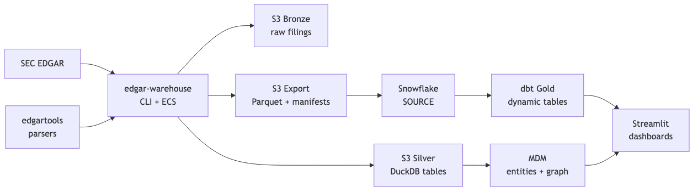
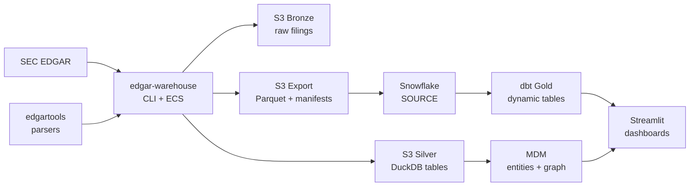

# EdgarTools Platform — Project Overview

A plain-language guide to what this repository is, how it uses the
[edgartools](https://github.com/dgunning/edgartools) Python library, and how
the pieces fit together.

---

## In one sentence

**EdgarTools Platform** is an AWS + Snowflake data platform that downloads SEC
EDGAR filings, cleans and models them, resolves companies/people/funds into a
master data graph, and serves analytics-ready tables to dashboards.

It is **not** the `edgartools` library itself. It is a full warehouse built
*on top of* that library (plus its own loaders, parsers, and cloud plumbing).

---

## Why this exists

The SEC EDGAR system publishes public company and investment-adviser filings
(Forms 10-K, 10-Q, 8-K, 3/4/5, 13F, ADV, and many more). Those filings are:

- Hard to consume at scale (thousands of companies, many form types, rate limits)
- Semi-structured (XML, HTML, XBRL, SGML, indexes)
- Useful only after cleaning, joining, and turning into business tables

This platform automates that path end to end:

| Stage | What happens |
| --- | --- |
| **Capture** | Download filings and metadata from SEC (and related sources) |
| **Store raw** | Keep immutable bronze copies in S3 |
| **Parse & clean** | Turn documents into typed silver tables (DuckDB on S3) |
| **Master data** | Resolve entities and relationships (MDM + graph) |
| **Analytics** | Build gold tables in Snowflake via dbt |
| **Consume** | Streamlit dashboards for operators and analysis |

---

## How `edgartools` fits in

[`edgartools`](https://github.com/dgunning/edgartools) is an open-source Python
package for working with SEC EDGAR data. This repo depends on it from PyPI:

```text
edgartools>=5.29.0
```

### What the platform does itself

Most of the heavy lifting is **this repository’s own code**, not the library:

- HTTP download of submissions JSON, daily indexes, and filing documents
- Rate limiting and retries against SEC endpoints
- Writing bronze objects to S3
- Silver DuckDB schema, shard layout, and gold export
- AWS ECS / Step Functions orchestration
- Snowflake native S3 pull, dbt models, dashboards
- MDM entity resolution and graph sync

### Where `edgartools` is used today

After bronze files are already stored, the warehouse uses `edgartools` as a
**parser / helper layer** for specific form families:

| Form / domain | edgartools surface | Platform adapter |
| --- | --- | --- |
| Forms **3, 4, 5** (insider ownership) | `edgar.ownership.Ownership.from_xml(...)` | `edgar_warehouse/parsers/ownership.py` |
| **13F** institutional holdings | `parse_infotable_xml` | `edgar_warehouse/parsers/thirteenf.py` |
| **8-K** earnings releases | `EarningsRelease` | `edgar_warehouse/parsers/earnings_release.py` |
| **DEF 14A** proxy compensation | `extract_summary_compensation` | `edgar_warehouse/parsers/proxy_fundamentals.py` |
| Filing attachments (fallback) | `edgar.get_by_accession_number` | `edgar_warehouse/bronze_filing_artifacts.py` |
| Universe / tickers (MDM seed & scripts) | ticker helpers, `get_filings`, etc. | MDM CLI + `scripts/batch/` |

**ADV (investment adviser)** forms are parsed by a **local** parser
(`edgar_warehouse/parsers/adv.py`), not by `edgartools`.

### Mental model

```text
SEC EDGAR
    │
    ▼
This repo downloads & stores raw files  ──►  Bronze (S3)
    │
    ▼
edgartools (+ local parsers) parse XML/HTML  ──►  Silver (DuckDB on S3)
    │
    ▼
MDM + gold build + Snowflake + dbt  ──►  Dashboards
```

Think of `edgartools` as a **specialized filing parser toolkit**. The platform
is the **factory** around it: ingest, store, orchestrate, model, and serve.

Batch scripts under `scripts/batch/` exercise many more `edgartools` APIs
(XBRL, 8-K sections, entity facts, etc.) as smoke tests when the library
version is bumped.

---

## End-to-end architecture



*Source: [diagrams/platform-architecture.mmd](diagrams/platform-architecture.mmd)
(also rendered as SVG).*



In words:

```text
SEC EDGAR API
      │
      ▼
edgar-warehouse CLI  (Python package: edgar_warehouse)
      │
      ├─► S3 bronze   (raw JSON / HTML / XML — immutable)
      ├─► S3 silver   (DuckDB tables — cleaned, typed)
      └─► S3 export   (Parquet + run manifests for Snowflake)
              │
              ▼
     Snowflake EDGARTOOLS_SOURCE   (native S3 pull)
              │
              ▼
     dbt dynamic tables  →  EDGARTOOLS_GOLD
              │
              ├─► Streamlit dashboard (in Snowflake)
              └─► MDM entities + hosted graph (in Snowflake)
```

**Cloud focus:** AWS for compute/storage; Snowflake for analytics, MDM
Postgres, and graph tables. Workload jobs (images, ECS tasks, Step Functions)
are deployed by operator scripts, not by packing full pipelines into Terraform.

---

## Data plane doctrine

**Current ingest doctrine** (supersedes “always bronze first” in older diagrams):

- **Silver** = runtime system of engagement  
- **edgartools** = exclusive SEC I/O gateway (cutover target)  
- **Bronze** = optional archive (explicit request or non-edgartools sources)  
- **Agent** = Snowflake Decision Contract only  

See [doctrine-data-plane.md](doctrine-data-plane.md) and [adr/0002-silver-soe-edgartools-exclusive.md](adr/0002-silver-soe-edgartools-exclusive.md).

## Questions & dashboards

What can this product answer, and how should UIs present it?

See **[product-questions-and-dashboards.md](product-questions-and-dashboards.md)** for:

- Question catalog by domain (universe, filings, insiders, 13F, fundamentals, ADV, graph, ops)
- Six proposed dashboard designs (Company 360, Insider Watch, screener, …)
- Suggested ship order and open product decisions

---

## Data layers (bronze → silver → gold)

Same idea as a medallion lakehouse, tailored to SEC filings.

### Bronze — “never rewrite history”

Raw payloads as downloaded from SEC (or operator-supplied ADV files):

- Company ticker snapshots
- Submissions JSON (per CIK)
- Daily form index files
- Primary filing documents and attachments

Paths live under S3 bronze prefixes such as `submissions/`, `filings/`,
`daily_index/`, `reference/`. Objects are treated as **additive and immutable**.
Loaders skip already-captured files unless an operator passes `--force`.

### Silver — “clean working tables”

Typed tables in DuckDB files on S3 warehouse storage, for example:

| Area | Example tables |
| --- | --- |
| Company | `sec_company`, addresses, former names, tickers, sync state |
| Filings | `sec_company_filing`, attachments, raw-object audit |
| Ownership | reporting owners, non-derivative & derivative transactions |
| ADV | adviser filings, offices, disclosures, private funds |
| Fundamentals | financial facts, derived metrics, earnings, executives, 13F holdings |

Silver is where parsers run and where MDM reads source data.

### Gold — “business-ready analytics”

Python builds export Parquet; Snowflake pulls it into `EDGARTOOLS_SOURCE`;
dbt materializes **dynamic tables** in `EDGARTOOLS_GOLD`, including:

| Gold table | Plain meaning |
| --- | --- |
| `company` | Company dimension |
| `filing_activity` / `filing_detail` | Filing volume and detail |
| `ownership_activity` / `ownership_holdings` | Insider trades and holdings |
| `adviser_offices` / `adviser_disclosures` / `private_funds` | Adviser / fund views |
| `ticker_reference` | CIK ↔ ticker map |
| `financial_facts` / `financial_derived` / `financial_factors` | Fundamentals |
| `earnings_releases` / `executive_records` / `accounting_flags` | Events & scores |
| `institutional_holdings` | 13F-style holdings |
| `edgartools_gold_status` | Freshness / health |

Dashboards read gold (and sometimes source/status), not raw SEC APIs.

---

## What kinds of SEC data are covered?

| Domain | Typical SEC forms | What you get |
| --- | --- | --- |
| **Company universe** | ticker JSON, submissions | CIK, name, SIC, addresses, filing list |
| **Insider ownership** | 3, 4, 5 | Who traded, shares, prices, roles (via edgartools) |
| **Institutional holdings** | 13F-HR | Manager holdings by CUSIP (via edgartools) |
| **Earnings & proxy** | 8-K, DEF 14A | GAAP metrics, executive compensation (via edgartools) |
| **Financial statements** | 10-K / 10-Q XBRL companyfacts | Facts + derived ratios + accounting scores |
| **Investment advisers** | ADV / IAPD (operator bronze) | Offices, disclosures, private funds |
| **Daily discovery** | SEC daily form index | “What filed today?” incremental loads |

---

## Master Data Management (MDM) and the graph

Raw filings mention the same company or person under many spellings and IDs.
**MDM** turns that noise into stable entities and relationships.

### Entities

- Company  
- Person (insiders, executives)  
- Adviser  
- Fund  
- Security  

### Relationships (examples)

| Relationship | Meaning |
| --- | --- |
| `IS_INSIDER` | Person is an insider of a company |
| `HOLDS` / `INSTITUTIONAL_HOLDS` | Ownership / 13F holdings |
| `MANAGES_FUND` | Adviser manages a private fund |
| `EMPLOYED_BY` | Person employed by company |
| `AUDITED_BY` | Auditor relationship |
| `HAS_PARENT_COMPANY` | Corporate hierarchy |

### Where the graph lives

Graph data is **hosted inside Snowflake** (Neo4j Graph Analytics native app /
graph-ready tables), not a separate external Neo4j server. One Snowflake
account boundary covers gold analytics, MDM operational Postgres (Snowflake
Postgres), and graph tables.

Typical MDM CLI flow:

```bash
edgar-warehouse mdm seed-universe
edgar-warehouse mdm run --entity-type all
edgar-warehouse mdm derive-relationships   # or backfill / load variants
edgar-warehouse mdm export
edgar-warehouse mdm sync-graph
edgar-warehouse mdm verify-graph
```

---

## Runtime: the `edgar-warehouse` CLI

The main product surface is a single CLI entry point:

```bash
edgar-warehouse --help
```

Defined in `edgar_warehouse/cli.py` → `edgar_warehouse` package.

### Common operator commands

| Command | Purpose |
| --- | --- |
| `seed-universe` | Load ticker universe / CIK tracking seed |
| `bootstrap` / `bootstrap-full` / `bootstrap-next` | Load company submissions & filings |
| `bootstrap-batch` | Parallel batch bootstrap (used by Step Functions) |
| `bootstrap-fundamentals` | Branch B: earnings, proxy, 13F, entity facts |
| `daily-incremental` | Process new filings for a date range |
| `parse-ownership-bronze` | Re-parse Forms 3/4/5 from bronze (no SEC calls) |
| `parse-adv-bronze` | Parse operator-supplied ADV bronze |
| `gold-refresh` | Rebuild gold / Snowflake export once |
| `targeted-resync` | Repair or re-fetch a single CIK / scope |
| `full-reconcile` | Compare expected vs actual warehouse state |
| `mdm …` | Entity resolution, graph, counts, migrations |

Required identity for SEC requests (must include an email):

```bash
export EDGAR_IDENTITY="EdgarTools Platform you@example.com"
```

Storage roots point at S3 bronze / warehouse / Snowflake export buckets (see
`Agents.md` / runbook for the full env list).

---

## How large loads are orchestrated (AWS)

For more than a handful of companies, do **not** run sequential local
`bootstrap-next` at scale. Use **Step Functions** (registered by
`infra/scripts/deploy-aws-application.sh`).

Canonical multi-company path: **`load_history`**

```text
1. Bronze + silver in parallel
   seed-universe → bootstrap-batch (many ECS tasks, limited concurrency)

2. MDM chain (after all bronze/silver windows finish)
   mdm run → relationships → export → sync-graph → verify-graph

3. Gold once
   gold-refresh → Snowflake manifest task → dbt/gold dynamic tables
```

Design rules that keep this safe:

- **`bootstrap-batch` does not rebuild gold** (avoids N× gold work)
- **`gold-refresh` runs once** after the full silver set exists
- SEC downloads are **idempotent** (skip cached artifacts; rate-limit only real network fetches)
- Prefer **low parallel concurrency** against SEC (typically a few concurrent ECS tasks)

Other workflows: `daily_incremental`, `bootstrap`, `targeted_resync`,
`gold_refresh`, MDM/gold replay machines.

---

## Repository map

| Path | What it is |
| --- | --- |
| `edgar_warehouse/` | Core Python platform (CLI, loaders, parsers, silver, gold, MDM) |
| `edgar_warehouse/parsers/` | Form parsers (ownership, ADV, 13F, earnings, proxy, …) |
| `edgar_warehouse/application/` | Commands, workflows, orchestrator |
| `edgar_warehouse/infrastructure/` | Settings, S3, SEC client, path catalog |
| `edgar_warehouse/mdm/` | Master data, API, graph, migrations |
| `infra/terraform/` | Passive AWS + Snowflake provisioning and access control |
| `infra/scripts/` | Deploy images, app rollout, Snowflake stack, MDM helpers |
| `infra/snowflake/dbt/edgartools_gold/` | dbt gold models |
| `infra/snowflake/sql/` | Bootstrap SQL, graph grants |
| `infra/snowflake/streamlit/` | Production Streamlit-in-Snowflake app |
| `examples/dashboard/` | Standalone Streamlit example |
| `scripts/batch/` | edgartools smoke / batch exploration scripts |
| `tests/` | Unit, architecture, MDM, integration tests |
| `docs/` | Runbooks, architecture, release readiness |

---

## Infrastructure at a glance

### AWS (passive shells + operator rollout)

Terraform creates things like:

- VPC, subnets, ECS cluster, log groups  
- S3 buckets: bronze, warehouse, Snowflake export  
- ECR repositories for warehouse and MDM images  
- Empty Secrets Manager containers  
- SNS for Snowflake manifest events  

Operators then:

1. Build/push Docker images (`publish-warehouse-image.sh`)  
2. Register ECS task definitions and Step Functions (`deploy-aws-application.sh`)  
3. Start executions with the deployer principal  

Runtime uses **service-assumed roles**, not long-lived runner access keys.

### Snowflake

- Storage integration + stage for S3 export  
- Source tables refreshed from Parquet manifests  
- dbt dynamic tables in `EDGARTOOLS_GOLD`  
- Streamlit app for interactive views  
- MDM Postgres + graph tables in the same platform boundary  

---

## Design principles (worth remembering)

1. **Immutable bronze** — SEC artifacts are not rewritten in place.  
2. **Idempotent loaders** — Re-runs skip work unless `--force`.  
3. **Parse after store** — Download first; parse from cached bronze when possible.  
4. **Separate concerns** — Parallel bronze ≠ MDM ≠ single gold refresh.  
5. **edgartools is a dependency, not the product** — Pin version; smoke-test with `scripts/batch/` on bumps.  
6. **AWS-first** — Active path is S3 + ECS + Step Functions + Snowflake.  
7. **Secrets stay out of Terraform inputs** — Identity and DSNs are populated out of band.  

---

## Quick start (developer orientation)

Full setup is in [`docs/runbook.md`](runbook.md). Minimal mental checklist:

```bash
# 1. Python env (uv is the project standard)
uv sync --extra s3 --extra snowflake

# 2. Identity + storage roots (example shapes — use real bucket names)
export EDGAR_IDENTITY="EdgarTools Platform you@example.com"
export WAREHOUSE_RUNTIME_MODE="bronze_capture"
export WAREHOUSE_BRONZE_ROOT="s3://…/warehouse/bronze"
export WAREHOUSE_STORAGE_ROOT="s3://…/warehouse"
export SERVING_EXPORT_ROOT="s3://…/snowflake_exports/"
export AWS_DEFAULT_REGION=us-east-1

# 3. Try the CLI
uv run edgar-warehouse --help

# 4. Fast tests
uv run pytest tests/unit tests/architecture
```

For production-scale company loads, use AWS Step Functions (`load_history`),
not long local sequential bootstraps.

---

## Related docs

| Doc | When to read it |
| --- | --- |
| [README.md](../README.md) | Short intro + edgartools usage table |
| [product-questions-and-dashboards.md](product-questions-and-dashboards.md) | Questions the product can answer + dashboard designs |
| [docs/data-architecture.md](data-architecture.md) | Deep pipeline inventory and table catalog |
| [docs/runbook.md](runbook.md) | End-to-end environment setup |
| [docs/neo4j.md](neo4j.md) | Hosted graph notes |
| [Agents.md](../Agents.md) / [CLAUDE.md](../CLAUDE.md) | Operator and agent conventions |

---

## Glossary (short)

| Term | Meaning |
| --- | --- |
| **CIK** | SEC Central Index Key — unique filer id |
| **Accession number** | Unique id for one SEC filing submission |
| **Bronze / silver / gold** | Raw → cleaned → analytics-ready layers |
| **DuckDB** | Embedded SQL engine used for silver state files |
| **MDM** | Master Data Management — entities and relationships |
| **dbt** | SQL transform tool that builds Snowflake gold tables |
| **Dynamic table** | Snowflake table that auto-refreshes from source SQL |
| **Step Functions** | AWS workflow orchestrator for multi-stage loads |
| **edgartools** | Upstream Python library for SEC filing access/parsing |

---

*This overview is meant to onboard humans and agents quickly. For operational
procedures and release gates, use the runbook and release-readiness docs.*
