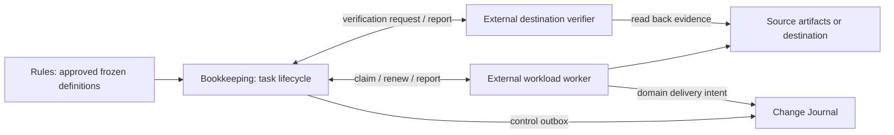

# Bookkeeping without loader dependencies

Owner: Codex. Date: 2026-10-02. Status: proposed design, not implemented.
Inspected main: `417147e8`, including the experiments in PR #784.

## Decision

Make Bookkeeping a control module with a fixed task protocol. Workload execution
and destination verification run outside its process. Bookkeeping stores and
validates work identities, leases, pinned references and completion evidence.
It does not import, select, instantiate or call a loader.

This separation works with existing loaders, a declarative reader, or another
implementation. Improving parsing configuration is independent work. It must
not be a prerequisite for removing control coupling.

## Coupling to remove

| Current code | Coupling introduced by the integration | Proposed replacement |
| --- | --- | --- |
| CLI construction (`edgar_warehouse/bookkeeping/clean/cli.py`) | Imports source-specific implementations and constructs MDM/Journal integrations inside Bookkeeping configuration. | Compose the control process using control storage and transport only; workload processes own their destination clients. |
| Capability interface (`edgar_warehouse/bookkeeping/clean/config.py`) and runner (`edgar_warehouse/bookkeeping/clean/runner.py`) | Execute/reconcile/verify callbacks receive the entire Bookkeeping object, allowing SQL and artifact access through private internals. | Give external workers a frozen task envelope and narrowly scoped control client. |
| A source's own capability module (see Examples) | Source pagination, the source's tables and Silver dependencies live in the control package. | Move behavior into a workload package/process with no access to Bookkeeping internals. |
| Completion (`edgar_warehouse/bookkeeping/clean/engine.py`) | Control re-enters destination-specific verifier callbacks. | Consume authenticated verification reports through a generic envelope validator. |
| Journal conversion (`edgar_warehouse/bookkeeping/clean/engine.py`) | Branches on acquisition and source-evidence operation names. | Emit generic control events. Domain workers emit domain events through their own durable delivery intents. |

Renaming an operation or relocating its Python file while retaining these
callbacks would leave the dependency in place. Remove the callback interface
from the new control path.

## Module responsibilities



| Module | Owns | Does not receive |
| --- | --- | --- |
| Rules | Approved pipeline definition, worker/verifier profiles, versions and hashes. | Mutable run status. |
| Bookkeeping | Dependency readiness, attempts, resource leases, fencing, checkpoints, accounting, generic expansion and control outbox. | Source records, loader objects, domain database clients or domain validators. |
| Workload worker | Acquisition, transformation or destination writes according to its pinned specification. | Bookkeeping engine, registry, SQL connection or private methods. |
| Destination verifier | Destination readback and domain-specific completion checks; immutable verification report. | Authority to mark Bookkeeping work complete or perform workload writes. |
| Change Journal | Durable control and domain history with idempotent delivery. | Work scheduling or mutable mastering state. |

Initially the workload worker can use today's proven loaders. Those dependencies
stay in that worker's package and process. The Bookkeeping package must be
installable and startable without any of them.

Use the existing AWS deployment direction: separately invoked local processes
for qualification and ECS tasks for AWS workers. This design adds no workflow
engine, cloud target, live task definition or IAM grant.

## Fixed task interface

The controller exposes one interface for every workload:

```text
submit(frozen_run_manifest) -> run_id
claim(worker_profile, bounded_limit) -> task_envelopes
renew(claim_identity) -> current_authority
report(claim_identity, candidate_reference | typed_failure) -> acknowledgement
verify_claim(verifier_profile, bounded_limit) -> verification_envelopes
verify_report(verification_identity, report_reference) -> acknowledgement
status(run_id) -> bounded_control_summary
resume(run_id) -> reconciliation_and_verification_work
```

These are proposed messages, not existing executable commands. Claims are
issued only to authenticated principals authorized for the frozen profile.
An identity is not trusted because it appears in a message body.

An execution task envelope contains only:

- Protocol version, run/step/unit identity, attempt and live claim identity.
- Frozen input references, workload-specification reference and Rules digest.
- Approved worker profile with immutable runtime digest/version.
- Intended output references, deterministic effect key and opaque resource keys.
- Deadline, retry limits and permitted generic control messages.

The workload specification holds source paths, reader/mapping rules and
destination settings. Bookkeeping verifies its bytes and binding to the approved
manifest, and treats its contents as opaque. Output destinations and credentials
must be restricted by approved worker configuration; a source document cannot
grant authority or supply an arbitrary import path/shell command.

The effect key identifies the logical work across retries. Attempt/fence
identifies current authority. Changing an input, Rules digest or runtime digest
requires new logical work; retrying unchanged work preserves its effect key.

## Completion without loader-dependent checks

1. Bookkeeping leases a ready task and seals its execution envelope.
2. The worker reconciles the deterministic effect key at its destination before
   executing. A prior committed effect produces evidence, not a repeated write.
3. The worker produces immutable candidate evidence and reports its reference.
   Reporting a candidate does not mark the task verified or release dependents.
4. Bookkeeping creates a verification request bound to the candidate hash,
   task/specification/input digests and current attempt. An authorized external
   verifier reads the destination and checks the pinned verification contract.
5. The verifier emits an authenticated report containing exact task bindings,
   candidate hash, verifier runtime/contract digest, required check results and
   destination proof references. Self-reported worker success is insufficient.
6. Bookkeeping checks issuer authority, bindings, hashes, required check IDs,
   bounded report schema and live fence. Only then can it atomically mark work
   verified, update permitted checkpoints and enqueue its control event.

Bookkeeping understands report structure and required check IDs, not what a
source's row, identifier, publication or pagination page means. Domain checks live with
the verifier. A report hash alone authenticates no issuer; admission requires
the authenticated reporting channel and authorization bound to the frozen
verifier profile. Persist that provenance with the report reference.

The task retains a live control lease through verification. A generic control
supervisor renews the reservation within its bounded deadline while workers
and verifiers run. Lease loss rejects completion; it never legitimizes an old
report. Recovery obtains new authority, reconciles existing destination effects
and issues fresh verification bound to the new attempt. Durable effect evidence
may describe the original commit attempt; the new verifier must prove it is
the same logical effect, rather than rewrite that evidence.

Destination commit fencing is enforced at the destination, not inferred from
Bookkeeping completion. Mutable stores must atomically reject stale authority
with the write. Immutable output uses attempt staging plus conditional creation
of the logical effect receipt. A timed-out external side effect without an
idempotency/reconciliation contract remains uncertain and blocks automatic
replay. There is no claim of a cross-database atomic transaction.

## Expansion, evidence and recovery

An expansion worker returns a hashed generic child-work manifest. Bookkeeping
validates permitted successor step, unique keys, bounded count, allowed output
locations, dependency references and the sealed parent identity before inserting
children atomically. It does not inspect a source's page names or generate its identifiers.
The worker and verifier own those domain checks.

The control outbox emits fixed lifecycle events with task identity and evidence
references. Acquisition authorization/outcome and MDM publication events belong
to their workload's journal integration. Acquisition must retain its durable
authorization acknowledgement before a request begins. A workload's verifier
must prove required domain delivery acknowledgement before control completion
where the frozen contract requires it. Removing source branches must preserve
these existing safety contracts.

| Situation | Required behavior |
| --- | --- |
| Worker commits, then crashes before reporting | New claim reconciles the effect key; verifier checks existing effect; no duplicate write. |
| Worker reports but loses acknowledgement | Same candidate binding is acknowledged idempotently; conflicting hashes block. |
| Lease expires before verification completes | Reject old completion; reacquire and reconcile with fresh verification. |
| Worker/verifier profile or contract changes | Existing run retains frozen definitions; unavailable pinned runtime blocks, no fallback. |
| Candidate or output is missing/corrupt | Verification fails; control remains incomplete; no silent recomputation of committed effects. |
| Journal unavailable | Keep local delivery intent; retry idempotently; required delivery gate remains incomplete. |
| Resume after destination changes | Reverify through the pinned external verifier before skipping retained completion. |
| Child worklist repeats or changes | Reconcile identical sealed manifest; reject conflicting scope. |

## Implementation order and proof required

1. Add the fixed protocol and role-restricted claim/report transitions using
   checksummed PostgreSQL migrations. Keep business data outside control tables.
2. Build a control-only package and entry point. Remove all domain imports,
   callback registry and operation-name branches from this new path.
3. Move each existing source's execution and verification behind external workers
   without changing their interpretation. Demonstrate control independence
   before changing source parsing configuration.
4. Qualify the protocol with artifact-copy and a second destination worker.
   Keep worker implementations and their tests separate from control tests.
5. Cut the active callers over only after parity, replay and failure gates pass.
   Preserve previous runtime/runs as rollback and audit artifacts; do not add
   automatic legacy fallback to the new path.

Acceptance gates for implementation:

- Import/dependency checks prove the control wheel excludes loaders, source modules,
  Silver, MDM, `edgar`, PyArrow and parser libraries; control starts with those
  dependencies absent. Check runtime imports as well as source imports.
- Two external workers exercise the same protocol without edits to Bookkeeping
  or its registry; approved worker profile additions require no control code.
- Real PostgreSQL 16 with restricted roles rejects stale fencing, unauthorized
  reporting, wrong issuer, wrong task/input/spec/runtime, forged check coverage
  and conflicting evidence. No prerequisite skips.
- Lost acknowledgement, lease expiry, crash after destination commit and
  conflicting output each prove the specified recovery behavior independently.
- Each source's pagination, classification, identity/publication and
  Journal authorization/outage/recovery tests retain their original assertions.
- Existing configuration counterexamples remain covered in worker tests.

## Design review and cost

The reviewed history includes the generic core (#732), stage worklists (#734),
Journal/fencing (#738) and the first source's integration (#755). Their present interface
exposes control internals to several actual workloads; this is demonstrated
coupling, not a hypothetical need for interchangeable parsers.

Use a small protocol with separate processes; no loader Strategy hierarchy or
callback facade is needed. The cost is explicit message schemas, worker/profile
authorization, separate verification and recovery transitions, plus packaging
and process supervision. That cost buys an enforceable dependency boundary;
moving literal field paths alone does not.

This document has been checked against current interfaces and failure paths.
The acceptance gates above have not run: the protocol is not implemented.
The 54 passing parsing experiments remain evidence about parsing behavior only.

## Examples

- The first source capability that lived in the control package was the SEC
  Company one, `edgar_warehouse/bookkeeping/clean/company.py` (since deleted,
  mastering to-do 20a and 20b). Its domain checks were Company rows, LEIs,
  SEC page names and CIK generation; those belong to its worker and verifier.
- The control wheel excludes the SEC and GLEIF loaders and `edgar`.
